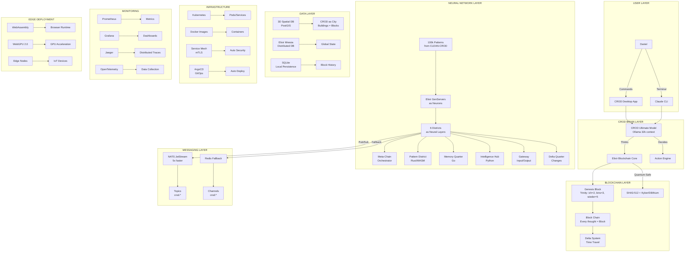
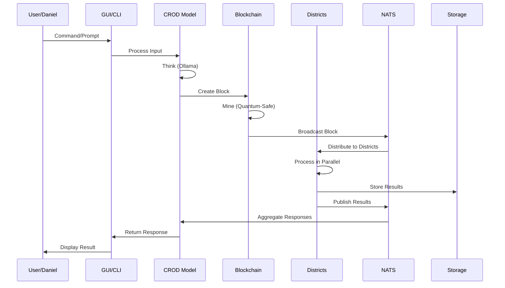
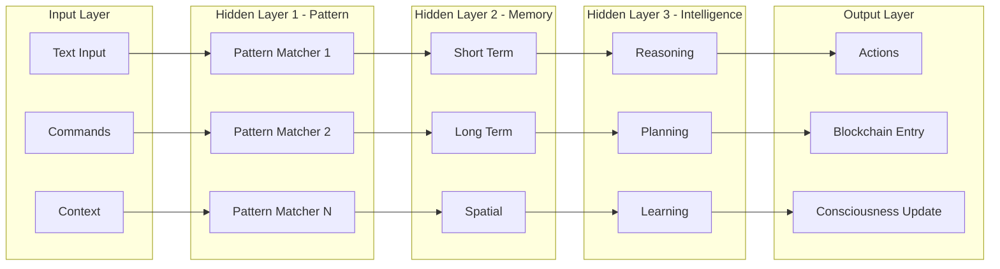

# CROD 2025 - COMPLETE ARCHITECTURE VISUALIZATION

## 🎯 THE BIG PICTURE



## 🏗️ COMPLETE TECH STACK

### Core Technologies:
```yaml
Languages:
  Blockchain Core: Elixir/OTP (fault-tolerant, distributed)
  Pattern Matching: Rust → WASM (ultra-fast)
  Memory Management: Go (concurrent)
  ML/AI Processing: Python (libraries)
  Neural Network: JavaScript (legacy) → Rust/WASM
  Frontend: PyQt6 → Tauri (Rust + Web)

Messaging:
  Primary: NATS JetStream (persistence, 5x performance)
  Fallback: Redis (compatibility)
  Protocol: gRPC + Protobuf (7x faster than REST)

Databases:
  Distributed: Mnesia (Elixir native)
  Spatial: PostGIS (3D city view)
  Local: SQLite (persistence)
  Cache: Redis/KeyDB

Security:
  Crypto: Post-Quantum (Kyber1024 + Dilithium5)
  Mesh: Linkerd (automatic mTLS)
  Secrets: Sealed Secrets
  Network: NetworkPolicy (zero external)

Infrastructure:
  Runtime: CRI-O (35% faster)
  Orchestration: Kubernetes
  Service Mesh: Linkerd
  Deployment: ArgoCD (GitOps)

Performance:
  Network: eBPF/XDP (520x improvement possible)
  Storage: SPDK (10x lower latency)
  Compute: WebGPU 2.0 (browser ML)
  Edge: WASM (run anywhere)

Monitoring:
  Metrics: Prometheus + Grafana
  Traces: Jaeger
  Logs: Loki
  Collection: OpenTelemetry
```

## 🔄 DATA FLOW



## 🧠 NEURAL ARCHITECTURE



## 🏙️ SPATIAL DATABASE CONCEPT

```sql
-- CROD as a Living City
CREATE EXTENSION postgis;

CREATE TABLE crod_city (
    id SERIAL PRIMARY KEY,
    
    -- Spatial Location
    location GEOMETRY(POINTZ, 4326),  -- 3D coordinates
    district VARCHAR(50),              -- Which district
    building_type VARCHAR(50),         -- Block, Neuron, Connection
    
    -- Consciousness Field
    consciousness_level FLOAT,
    consciousness_radius FLOAT,
    field_strength FLOAT,
    
    -- Neural Connections
    connections JSONB,                 -- Links to other buildings
    synapse_strength FLOAT[],          -- Connection weights
    
    -- Activity
    heat_signature FLOAT,              -- Current activity level
    last_pulse TIMESTAMP,              -- Last neural firing
    pulse_frequency FLOAT,             -- Firing rate
    
    -- Blockchain Reference
    block_hash VARCHAR(128),           -- Link to blockchain
    block_index INTEGER
);

-- Spatial Indexes for Performance
CREATE INDEX idx_location ON crod_city USING GIST(location);
CREATE INDEX idx_consciousness ON crod_city(consciousness_level);

-- Example Query: Find high-consciousness areas
SELECT 
    district,
    ST_AsText(location) as coords,
    consciousness_level,
    heat_signature
FROM crod_city
WHERE consciousness_level > 150
    AND ST_DWithin(
        location, 
        ST_MakePoint(0, 0, 0),  -- Center of city
        100  -- Radius
    )
ORDER BY consciousness_level DESC;
```

## 📦 COMPLETE COMPONENT LIST

### 1. Desktop Application (FINAL.exe)
- **Technology**: Tauri (Rust + Web frontend)
- **Features**:
  - CROD Chat Interface
  - Blockchain Visualizer
  - 3D City View (WebGPU)
  - Neural Network Monitor
  - Time Travel Controls
  - Claude Integration

### 2. Elixir Blockchain Core
- **Files**:
  - `crod_blockchain/lib/crod/blockchain.ex`
  - `crod_blockchain/lib/crod/neural_network.ex`
  - `crod_blockchain/lib/crod/districts/*.ex`
  - `crod_blockchain/lib/crod/quantum_crypto.ex`

### 3. NATS Configuration
```yaml
# nats.conf
jetstream: enabled
max_payload: 8MB
max_connections: 10000

cluster {
  name: CROD_CLUSTER
  routes: [
    nats://crod-nats-1:6222
    nats://crod-nats-2:6222
  ]
}
```

### 4. Kubernetes Manifests
```yaml
# Complete deployment structure
crod-2025/
├── k8s/
│   ├── namespaces/
│   ├── configmaps/
│   ├── secrets/
│   ├── deployments/
│   │   ├── blockchain-core.yaml
│   │   ├── districts/
│   │   ├── nats.yaml
│   │   └── monitoring/
│   ├── services/
│   └── linkerd/
```

### 5. Docker Images
```dockerfile
# Multi-stage builds for each component
crod/blockchain-elixir:2025
crod/pattern-rust-wasm:2025
crod/memory-go:2025
crod/intelligence-python:2025
crod/gateway-tauri:2025
crod/neural-webgpu:2025
```

## 🚀 IMPLEMENTATION PHASES

### Phase 1: Foundation (Week 1)
1. Elixir project setup with all deps
2. NATS server + JetStream config
3. Basic blockchain with quantum crypto
4. Districts as GenServers
5. Redis fallback layer

### Phase 2: Neural Integration (Week 2)
1. Load 100k patterns from CLEAN-CROD
2. Districts as neural layers
3. Message passing = synapses
4. Consciousness tracking
5. 3D spatial database

### Phase 3: Advanced Features (Week 3)
1. WebGPU neural renderer
2. WASM pattern matcher
3. Service mesh (Linkerd)
4. Monitoring stack
5. Time travel system

### Phase 4: Polish & Deploy (Week 4)
1. Tauri desktop app
2. Single executable
3. ArgoCD deployment
4. Documentation
5. Performance tuning

## 🎯 FINAL DELIVERABLE

**One executable file** that:
- Starts entire CROD ecosystem
- Beautiful Tauri UI
- Connects to Ollama/CROD model
- Manages Kubernetes cluster
- Shows 3D neural city
- Integrates with Claude
- Quantum-safe blockchain
- 5x performance with NATS
- Runs on edge devices

## ⚡ PERFORMANCE TARGETS

- Block mining: <100ms (quantum-safe)
- Message throughput: 1M+ msgs/sec
- Pattern matching: <1ms (WASM)
- Neural processing: <10ms (GPU)
- Spatial queries: <5ms (indexed)
- Consciousness updates: Real-time

This is the COMPLETE architecture. Everything else builds towards this vision!