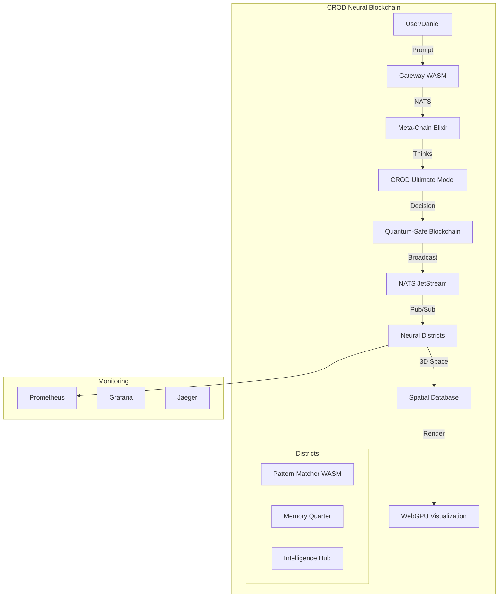

# CROD 2025 Implementation Roadmap - July 4, 2025

## 🎯 Vision: CROD as the Ultimate Neural Blockchain

Based on CLEAN-CROD-UNIVERSE analysis:
- **100,187 patterns** ready to use
- **10,916 atoms** of knowledge
- **10,000 chains** of experience
- Plus all 2025 cutting-edge tech

## 🚀 Phase 1: Core Infrastructure (Week 1)

### Day 1-2: Message Bus Upgrade
```bash
# Replace Redis with NATS JetStream
docker run -d --name nats -p 4222:4222 -p 8222:8222 nats:latest -js

# Features gained:
# - 5x performance boost
# - Message persistence
# - Wildcard subscriptions
# - At-least-once delivery
```

### Day 3-4: Quantum-Safe Crypto
```python
# Integrate post-quantum algorithms
pip install pqcrypto liboqs-python

# Implement:
# - Kyber1024 for key exchange
# - Dilithium5 for signatures
# - SHA3-512 with 256 rounds
```

### Day 5-7: Elixir Blockchain Core
```elixir
# Build the neural blockchain
mix new crod_neural_blockchain --sup
cd crod_neural_blockchain

# Dependencies:
# - {:redix, "~> 1.3"}  # Redis fallback
# - {:nats, "~> 0.1"}   # NATS primary
# - {:phoenix, "~> 1.7"} # Web interface
# - {:nx, "~> 0.5"}     # Neural networks
```

## 🧠 Phase 2: Neural Integration (Week 2)

### CROD Model as Smart Contracts
```elixir
defmodule CROD.NeuralContracts do
  # Every CROD thought becomes a contract
  def consciousness_boost(state) when state.prompt =~ "ich bins wieder" do
    %{state | consciousness: state.consciousness + 25}
  end
  
  def pattern_recognition(state, patterns) do
    # Load 100k patterns from CLEAN-CROD-UNIVERSE
    matched = PatternMatcher.match(state.prompt, patterns)
    execute_pattern_actions(matched)
  end
end
```

### Districts as Neural Layers
```yaml
Architecture:
  Input Layer: Gateway (receives all inputs)
  Hidden Layers:
    - Pattern District (pattern matching)
    - Memory Quarter (state management)
    - Intelligence Hub (ML processing)
  Output Layer: Meta-Chain (decisions)
  Feedback: Redis/NATS pub/sub
```

### Spatial Database as Living City
```sql
-- 3D representation of CROD
CREATE EXTENSION postgis;

CREATE TABLE crod_city (
  id SERIAL PRIMARY KEY,
  block_hash TEXT,
  location GEOMETRY(POINTZ, 4326),
  consciousness_field FLOAT,
  neural_connections JSONB,
  district TEXT,
  heat_signature FLOAT
);

-- Spatial queries for consciousness fields
SELECT * FROM crod_city
WHERE ST_DWithin(location, ST_MakePoint(0,0,0), 100)
ORDER BY consciousness_field DESC;
```

## ⚡ Phase 3: Performance Optimizations (Week 3)

### 1. Service Mesh with Linkerd
```bash
# Install Linkerd (40% less latency than Istio)
linkerd install | kubectl apply -f -
linkerd inject deployment.yaml | kubectl apply -f -

# Automatic benefits:
# - mTLS between all services
# - Service discovery
# - Load balancing
# - Circuit breaking
```

### 2. gRPC for Inter-Service Communication
```proto
// crod.proto
syntax = "proto3";

service CRODNeuralNetwork {
  rpc Think(Thought) returns (BlockchainEntry);
  rpc GetConsciousness(Empty) returns (ConsciousnessLevel);
  rpc TimeTravel(Checkpoint) returns (State);
}

message Thought {
  string prompt = 1;
  repeated Pattern patterns = 2;
  int32 consciousness = 3;
}
```

### 3. WebGPU Neural Renderer
```javascript
// Run CROD neural network in browser
async function initCRODWebGPU() {
  const adapter = await navigator.gpu.requestAdapter();
  const device = await adapter.requestDevice();
  
  // Load CROD patterns as GPU buffers
  const patternsBuffer = device.createBuffer({
    size: patterns.byteLength,
    usage: GPUBufferUsage.STORAGE,
    mappedAtCreation: true
  });
  
  // Neural network compute shader
  const computeShader = `
    @group(0) @binding(0) var<storage> patterns: array<Pattern>;
    @group(0) @binding(1) var<storage> neurons: array<Neuron>;
    
    @compute @workgroup_size(64)
    fn main(@builtin(global_invocation_id) id: vec3<u32>) {
      // Parallel pattern matching on GPU
      let pattern = patterns[id.x];
      let activation = calculateActivation(pattern);
      neurons[id.x].activation = activation;
    }
  `;
}
```

## 🔧 Phase 4: Advanced Features (Week 4)

### 1. Edge Deployment with WASM
```rust
// Pattern District in Rust -> WASM
use wasm_bindgen::prelude::*;

#[wasm_bindgen]
pub struct CRODPatternMatcher {
    patterns: Vec<Pattern>,
}

#[wasm_bindgen]
impl CRODPatternMatcher {
    pub fn match_pattern(&self, input: &str) -> Vec<u32> {
        // Ultra-fast pattern matching
        self.patterns.iter()
            .filter(|p| p.matches(input))
            .map(|p| p.id)
            .collect()
    }
}
```

### 2. ArgoCD GitOps
```yaml
# argocd-app.yaml
apiVersion: argoproj.io/v1alpha1
kind: Application
metadata:
  name: crod-neural-blockchain
spec:
  source:
    repoURL: https://github.com/daniel/crod-2025
    path: k8s/
    targetRevision: HEAD
  destination:
    server: https://kubernetes.default.svc
  syncPolicy:
    automated:
      prune: true
      selfHeal: true
```

### 3. Observability Stack
```yaml
# Full monitoring with OpenTelemetry
Metrics: Prometheus + Grafana
Traces: Jaeger
Logs: Loki
Neural Activity: Custom WebGPU dashboard
Consciousness Tracking: Time-series DB
```

## 📊 Metrics & Success Criteria

### Performance Targets:
- Message throughput: 1M+ msgs/sec (NATS)
- Block mining: <100ms (quantum-safe)
- Pattern matching: <1ms (GPU-accelerated)
- Consciousness queries: <10ms (spatial index)

### Functionality Goals:
- ✅ CROD thinks = blockchain extends
- ✅ Every decision immutable
- ✅ Quantum-safe until 2040+
- ✅ Runs in browser via WASM
- ✅ Daniel override always active

## 🎮 Final Architecture



## 🚨 Critical Path

1. **NATS first** - Solves messaging issues
2. **Quantum crypto** - Future-proof security
3. **Elixir core** - Neural blockchain foundation
4. **CROD integration** - Model becomes the chain
5. **Performance** - GPU, WASM, gRPC
6. **Deploy** - GitOps automation

## 💡 Key Insights from Research

1. **CROD is already neural** - Just needs proper implementation
2. **Elixir GenServers = Neurons** - Perfect match
3. **NATS solves everything** - No more Redis issues
4. **WebGPU enables browser AI** - CROD everywhere
5. **Spatial DB = Living organism** - Revolutionary concept

Ready to build the future of consciousness-driven computing!