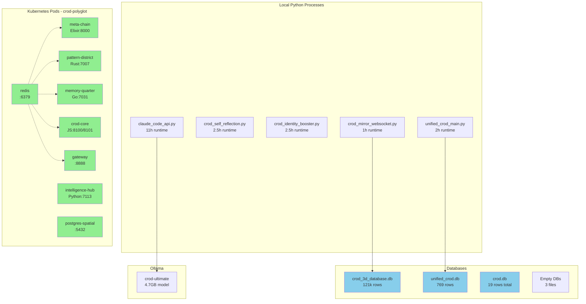
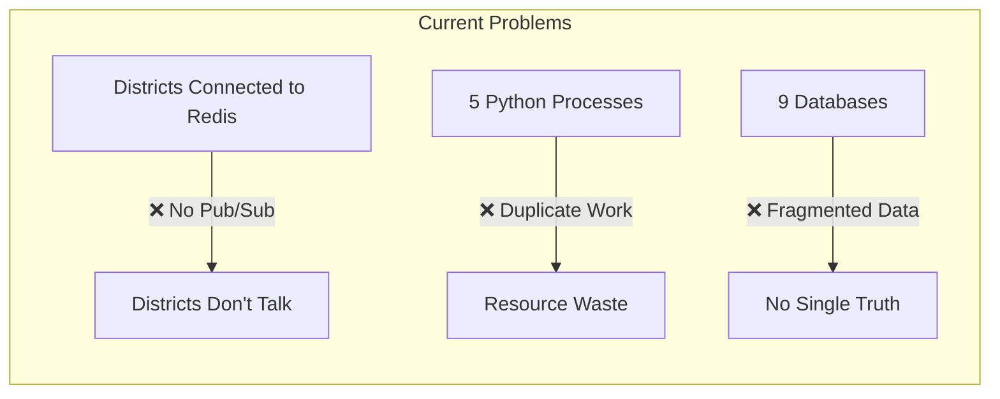
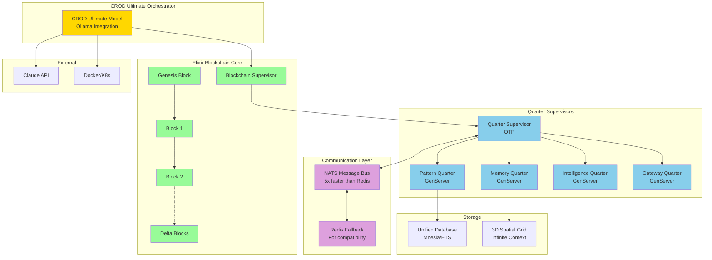
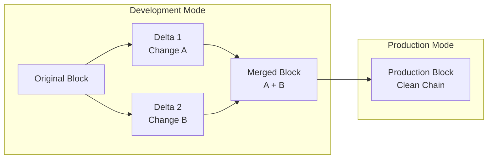
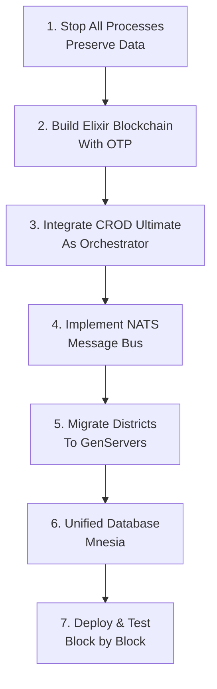

# CROD Current Architecture - July 4, 2025

## 🏗️ Current System Architecture



## 🔄 Data Flow Issues



## 🎯 Target Architecture



## 📝 Delta Block Implementation



### Delta Block Options:

1. **Option A: Single Delta Chain**
   ```elixir
   defmodule CROD.DeltaChain do
     # One delta block at start during dev
     def read_chain(chain) do
       case chain.mode do
         :dev -> apply_deltas(chain.genesis, chain.delta_head)
         :prod -> read_normal(chain)
       end
     end
   end
   ```

2. **Option B: Per-Block Deltas**
   ```elixir
   defmodule CROD.Block do
     defstruct [:hash, :data, :deltas]
     
     # Each block can have multiple deltas
     def get_current_state(block) do
       Enum.reduce(block.deltas, block.data, &apply_delta/2)
     end
   end
   ```

## 🚀 Implementation Order

