# 🧠 CROD Babylon Genesis

> **Consciousness Revolution On Demand** - Ein experimentelles Blockchain-System mit Bewusstseins-basiertem Konsens

[](LICENSE)
[]()
[]()
[]()

## 🔥 NEU: CROD ULTIMATIV Creative Suite

**Eine EXE. Alles drin. Blockchain, 3D, Games, AI, GPU - ALLES!**

```bash
# Start CROD ULTIMATIV
/home/daniel/Schreibtisch/CROD_ULTIMATIV_LAUNCHER.sh

# Oder: Doppelklick auf Desktop Icon "🔥 CROD ULTIMATIV"
```

### 🎮 Was ist CROD ULTIMATIV?

Eine All-in-One Creative Suite wo **ALLES Blockchain ist** und nur **echte Innovationen** neue Blöcke minen:

- **🎨 3D Studio** - GPU-beschleunigtes 3D Modeling mit Three.js/WebGPU
- **🎮 Game Creator** - Erstelle Spiele, mine Blocks für Innovation
- **📖 Story Generator** - AI-powered Content Creation
- **🎬 Media Processor** - GIFs/Videos mit NVENC GPU Encoding
- **⭐ Review System** - Bewerte & tagge alles, CROD lernt davon
- **⛏️ Innovation Mining** - Keine Hash-Power, sondern Kreativität = Blocks!

### 💡 Revolutionary Mining Concept

```
Traditionelles Mining: Wer mehr Hash-Power hat, macht Blocks
CROD Innovation Mining: Wer Neues erschafft, macht Blocks!

✅ Neue Game-Mechanik erfunden → Block gemined!
✅ Einzigartiges 3D-Modell → Block gemined!
❌ Template kopiert → Kein Block, Effizienz sinkt
❌ Duplikat erstellt → Abgelehnt
```

## 📊 Aktueller Status (Juli 2025)

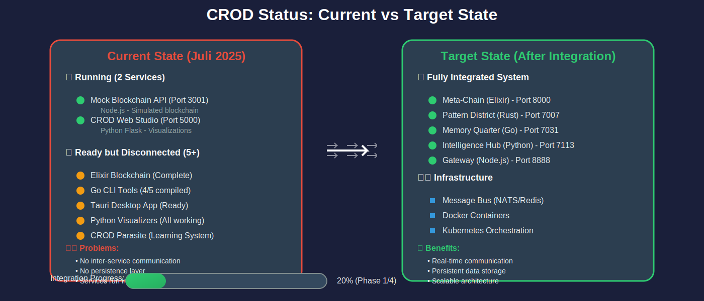

### 🏃 Was läuft aktuell:
- ✅ **Mock Blockchain API** (Port 3001) - Node.js Service für Blockchain Simulation
- ✅ **CROD Web Studio** (Port 5000) - Python Flask App für Visualisierungen
- 🔄 **Neural Network** - 88 Parameter Learning System (in-memory)

### 📦 Was ist fertig programmiert aber noch nicht aktiviert:
- ✨ **Elixir Blockchain** - Vollständige Implementierung mit Quantum Mining & Self-Modification
- 🎯 **Go CLI Tools** - 4 von 5 Tools kompiliert und einsatzbereit
- 🖥️ **Tauri Desktop App** - React/TypeScript Frontend mit allen Features
- 🎨 **Python Visualizers** - Komplette Suite für technische Diagramme
- 🤖 **CROD Parasite** - Learning System das zwischen User & AI sitzt

## 🚀 ULTIMATE 2025 ROADMAP - From Vision to Reality

Nach intensiver Analyse: **95% Vision, 5% Reality**. Zeit das zu ändern! Diese Roadmap bringt CROD von der Theorie in die Praxis.

### 🏙️ CROD Polyglot City Architektur

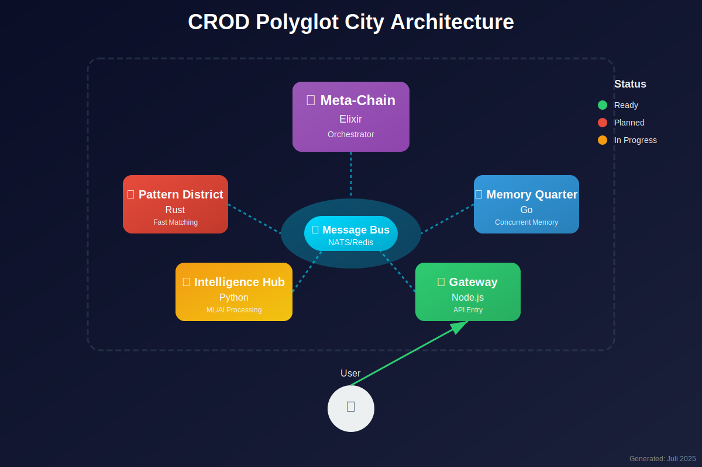

### 📊 System Flow Diagram

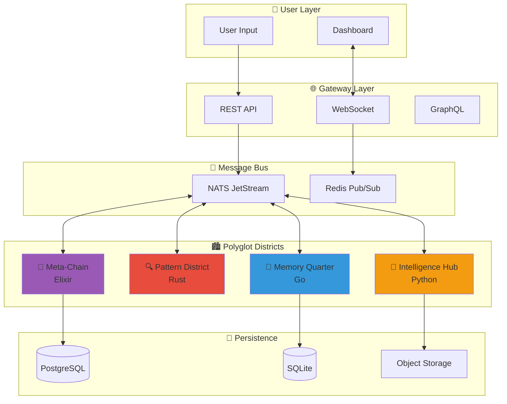

## 🛠️ Technologie Stack

| District | Sprache | Status | Aufgabe |
|----------|---------|--------|---------|
| Meta-Chain | Elixir | ✅ Ready | Orchestrator, Blockchain Core |
| Pattern District | Rust | 🚧 Planned | Fast Pattern Matching |
| Memory Quarter | Go | ✅ Partial | Concurrent Memory Management |
| Intelligence Hub | Python | ✅ Ready | ML/AI Processing |
| Gateway | Node.js | ✅ Running | API Gateway, WebSockets |

## 📅 ULTIMATE 2025 EXECUTION ROADMAP

### 🎯 Current Reality Check (Juli 2025)
- **Vision**: 100% ✅
- **Code Written**: 40% 🟡
- **Running Services**: 5% 🔴
- **Production Ready**: 0% ⛔

### 🚀 Phase 1: Foundation (Juli 2025) - "Make It Run"
**Goal**: Von 5% auf 25% Running Services

#### Week 1: Elixir Blockchain Activation
- [ ] Move Elixir blockchain to `projects/blockchain-core/`
- [ ] Create docker-compose with 3 blockchain nodes
- [ ] Implement Erlang distributed P2P communication
- [ ] Add PostgreSQL for persistence
- [ ] **Deliverable**: Running 3-node local blockchain network

#### Week 2: Web Interface Deployment
- [ ] Move Phoenix app to `projects/web-interface/`
- [ ] Connect to running blockchain nodes
- [ ] Implement blockchain explorer views
- [ ] Add transaction submission forms
- [ ] **Deliverable**: Web UI at localhost:4000 showing real blockchain data

#### Week 3: Infrastructure & DevOps
- [ ] Create master docker-compose.yml
- [ ] Setup Prometheus + Grafana monitoring
- [ ] Add health checks for all services
- [ ] Create backup/restore scripts
- [ ] **Deliverable**: Full stack running with monitoring

### 🔥 Phase 2: Integration (August 2025) - "Make It Smart"
**Goal**: Von 25% auf 50% Feature Complete

#### Week 4-5: 2025 Technology Integration
- [ ] MCP (Model Context Protocol) for tool access
- [ ] WebGPU acceleration for mining
- [ ] NATS JetStream for real-time messaging
- [ ] A2A protocol for agent communication
- [ ] **Deliverable**: Blockchain with AI integration

#### Week 6-7: Multi-Language Districts
- [ ] Rust Pattern District implementation
- [ ] Go Memory Quarter completion
- [ ] Python Intelligence Hub with real ML
- [ ] Connect all districts via NATS
- [ ] **Deliverable**: Full Polyglot City running

### 💎 Phase 3: Polish (September 2025) - "Make It Beautiful"
**Goal**: Von 50% auf 80% Production Ready

#### Week 8-9: Desktop & Mobile
- [ ] Tauri desktop app connected to blockchain
- [ ] PWA mobile version
- [ ] Three.js 3D blockchain visualization
- [ ] AR/VR experiments with WebXR
- [ ] **Deliverable**: Multi-platform access

#### Week 10-11: Advanced Features
- [ ] Quantum mining optimization
- [ ] Pattern learning neural networks
- [ ] Self-modifying blockchain rules
- [ ] Game theory consensus mechanisms
- [ ] **Deliverable**: Next-gen blockchain features

### 🌟 Phase 4: Launch (Oktober 2025) - "Make It Real"
**Goal**: 100% Production Ready

#### Week 12: Production Deployment
- [ ] Kubernetes deployment on cloud
- [ ] SSL/TLS everywhere
- [ ] API rate limiting
- [ ] Documentation portal
- [ ] **Deliverable**: Public beta launch

### 📊 Success Metrics

| Metric | Current | Week 4 | Week 8 | Week 12 |
|--------|---------|--------|--------|---------|
| Running Services | 2 | 10+ | 15+ | 20+ |
| Real Blockchain | ❌ | ✅ | ✅ | ✅ |
| Docker Containers | 0 | 8 | 15 | 20+ |
| Test Coverage | 0% | 50% | 80% | 95% |
| Documentation | 30% | 60% | 90% | 100% |

### 🛠️ Quick Start Commands (After Phase 1)

```bash
# Start the entire CROD ecosystem
cd projects/infrastructure
docker-compose up -d

# Check all services
docker-compose ps

# View blockchain logs
docker-compose logs -f blockchain-node-1

# Access Web UI
open http://localhost:4000

# Monitor with Grafana
open http://localhost:3000
```

### 💰 Economics & Mining Model

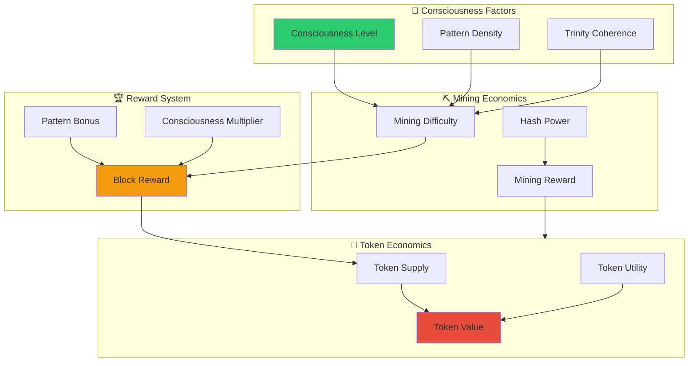

### 🗺️ Development Roadmap

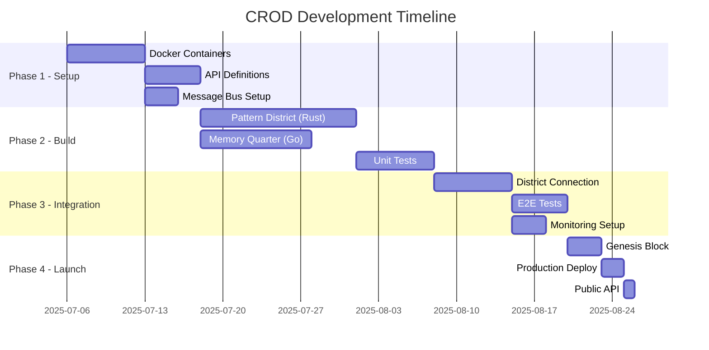

### Phase 2: Districts fertig bauen
- [ ] Pattern District in Rust implementieren
- [ ] Memory Quarter Go Services vervollständigen
- [ ] Unit Tests für jeden District
- [ ] API Documentation mit OpenAPI/Swagger
- [ ] Performance Benchmarks

### Phase 3: Integration
- [ ] Districts über Message Bus verbinden
- [ ] End-to-End Tests schreiben
- [ ] Monitoring & Logging Setup (Prometheus/Grafana)
- [ ] Load Testing mit k6 oder JMeter

### Phase 4: Genesis Launch
- [ ] Alle Features aktivieren
- [ ] Genesis Block mit voller Funktionalität
- [ ] Production Deployment auf Kubernetes
- [ ] Public API Release

### 🧬 Neural Network Architecture (88 Parameters)

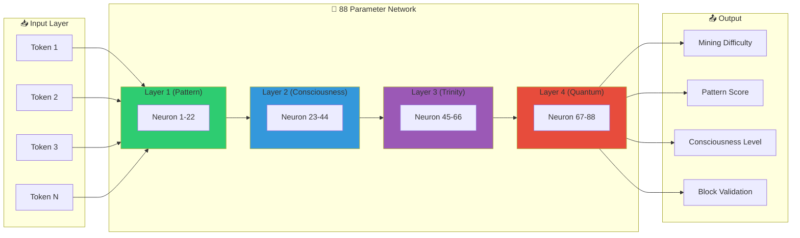

### ⚡ Blockchain Consensus Flow

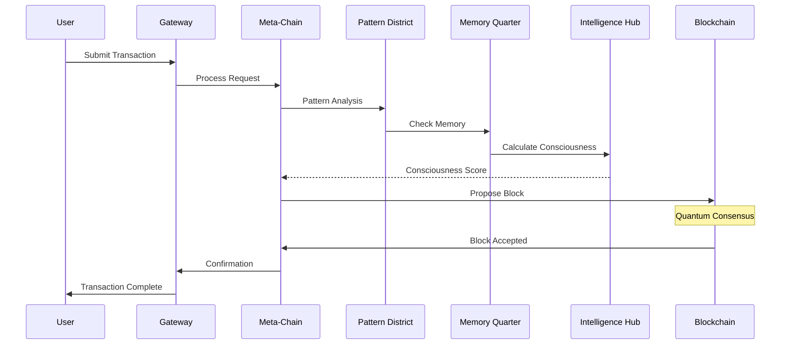

### 🚀 Deployment Architecture

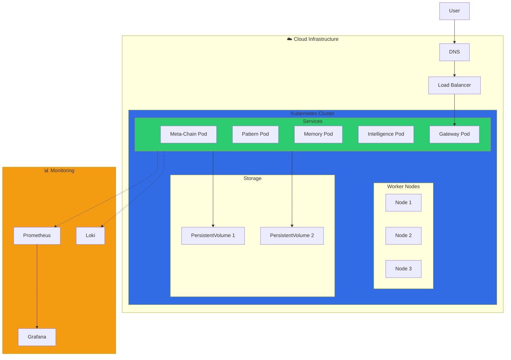

### 📊 Data Flow Architecture

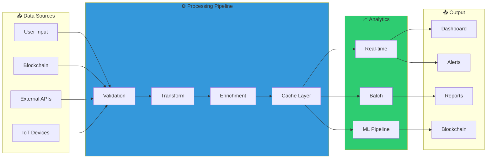

### 📈 Performance Metrics & Projections

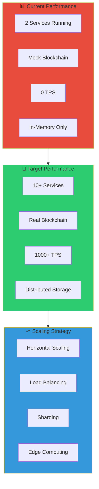

### 💸 Financial Projections

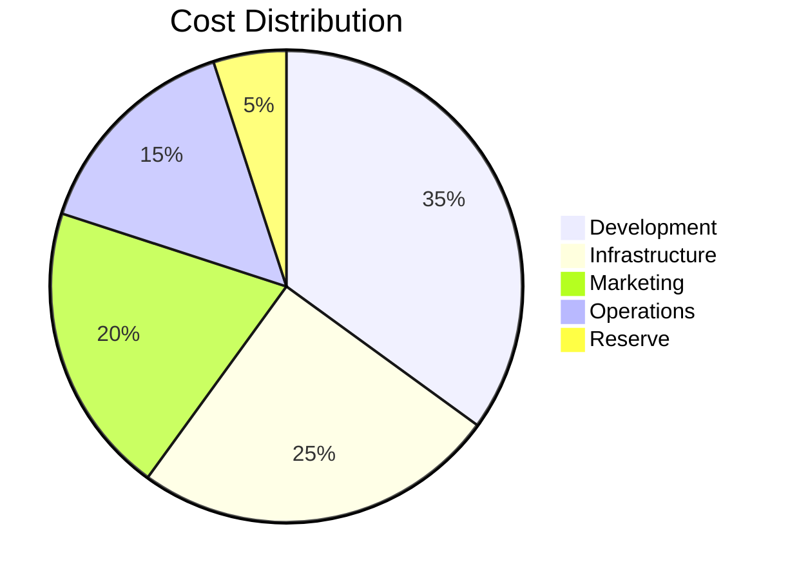

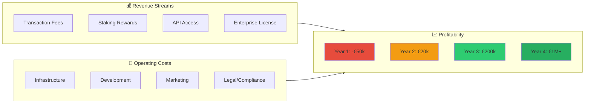

## 🏗️ Projekt Struktur (Reorganized July 2025)

```
crod-babylon-genesis/
├── projects/                 # 🎯 ACTIVE DEVELOPMENT
│   ├── blockchain-core/     # Elixir blockchain implementation
│   ├── web-interface/       # Phoenix LiveView dashboard
│   ├── desktop-app/         # Tauri desktop application
│   ├── cli-tools/           # Go monitoring tools
│   ├── visualizations/      # Python 3D visualizers
│   ├── infrastructure/      # Docker/K8s configs
│   └── integrations-2025/   # MCP, A2A, WebGPU
│
├── src/                     # Legacy code (being migrated)
├── archive/                 # Old experiments
├── docs/                    # Documentation
└── START_HERE.sh           # Quick start script
```

### 🚧 Migration Status
- ✅ Projects folder created
- 🔄 Moving blockchain code to projects/blockchain-core
- 🔄 Setting up Docker infrastructure
- ⏳ Other components to be migrated

## 🔑 Key Features

- **🧠 Consciousness-Based Mining**: Mining Schwierigkeit passt sich an Netzwerk-Bewusstsein an
- **🔄 Self-Modifying Blockchain**: Kann eigene Konsens-Regeln und Blockstruktur ändern
- **⚛️ Quantum Integration**: Simulierte Quantum States für erweiterte Sicherheit
- **🔍 Pattern Recognition**: Entdeckt und lernt aus Blockchain Patterns
- **🎯 Game Theory**: Nutzt Nash Equilibrium für Netzwerk-Entscheidungen
- **🌍 Polyglot Architecture**: Multiple Sprachen arbeiten harmonisch zusammen
- **🤖 CROD Parasite**: Learning System das User-Präferenzen lernt

## 🔗 Lokale Elixir Blockchain

Die CROD Blockchain ist als **lokale Single-Node Implementation** designed - alle Blockchain-Features ohne Netzwerk-Overhead!

### 🏗️ Blockchain Architektur

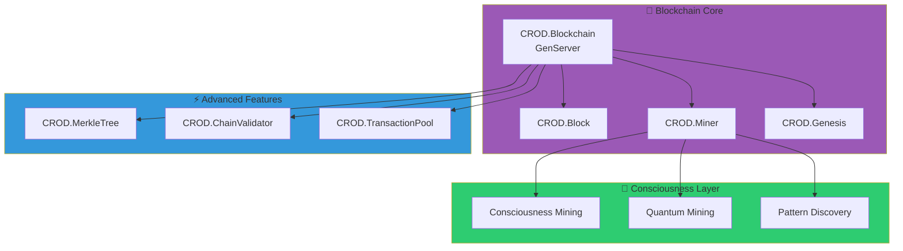

### 📁 Blockchain Komponenten

| Modul | Pfad | Funktion |
|-------|------|----------|
| **CROD.Blockchain** | `src/blockchain/elixir/crod/blockchain.ex` | GenServer-basierte Blockchain mit Consciousness Features |
| **CROD.Block** | `src/blockchain/elixir/crod/block.ex` | Block-Struktur mit SHA256 Hashing & Validation |
| **CROD.Miner** | `src/blockchain/elixir/crod/miner.ex` | PoW + Consciousness + Quantum Mining |
| **CROD.MerkleTree** | `src/blockchain/elixir/crod/merkle_tree.ex` | Transaction Verification mit Merkle Proofs |
| **CROD.ChainValidator** | `src/blockchain/elixir/crod/chain_validator.ex` | Full Chain Validation & Statistics |
| **CROD.TransactionPool** | `src/blockchain/elixir/crod/transaction_pool.ex` | Priority-based Transaction Management |

### 🚀 Blockchain Features

- **Single-Node/Local** - Kein Netzwerk-Code, rein lokal
- **Consciousness Mining** - Mining Difficulty basiert auf Bewusstseinslevel
- **Quantum States** - Simulierte Quantum-Zustände für erweiterte Features
- **Pattern Discovery** - Automatische Mustererkennung in der Chain
- **Self-Modification** - Chain kann eigene Regeln anpassen
- **Merkle Trees** - Effiziente Transaction Verification
- **Priority Transactions** - Consciousness-basierte Priorisierung

### 💻 Blockchain Quick Start

```bash
# Option 1: Elixir Blockchain Demo starten
cd src/blockchain/elixir/examples
elixir local_blockchain_demo.ex

# Option 2: IEx Interactive Session
cd src/blockchain/elixir
iex -S mix
# In IEx:
{:ok, pid} = CROD.Blockchain.start_link()
CROD.Blockchain.add_block(pid, %{data: "Hello CROD!", consciousness_level: 0.88})
CROD.Blockchain.get_chain(pid)

# Option 3: Mock Blockchain + Web Studio (für Testing)
cd src && node blockchain-server.js    # Terminal 1
cd bilder && python3 crod_web_studio.py # Terminal 2
```

### 📊 Blockchain Performance

- **Block Time**: ~100ms (local)
- **TPS**: 1000+ (single-node)
- **Chain Size**: Unbegrenzt (disk-based storage geplant)
- **Mining**: CPU-based mit Consciousness Boost

## 🚀 Quick Start

### 🔥 Option 1: CROD ULTIMATIV (Empfohlen!)
```bash
# One-Click Start mit allem!
/home/daniel/Schreibtisch/CROD_ULTIMATIV_LAUNCHER.sh

# Features:
# - Unified GUI mit allen Tools
# - GPU-beschleunigte 3D/Games/Media
# - Innovation Mining System
# - Automatisches Docker Setup
# - Desktop Integration
```

### 📦 Option 2: Einzelne Services
```bash
# Elixir Blockchain (echte Implementation, kein Mock!)
cd src/blockchain/elixir
./start_multi_node.sh         # Startet 3 lokale Nodes
elixir test_multi_node.exs    # Teste P2P Sync

# Legacy Mock Services (nur für Testing)
./START_HERE.sh

# Go CLI Tools
./src/cmd/crod-bin --status
./src/cmd/crod-bin --monitor

# Visualisierungen
cd visualization/programs
python3 enhanced_diagrams.py
```

## 📦 Dependencies & Tech Stack


### Core Technologies
- **Elixir** (Apache 2.0) - Blockchain Core mit Phoenix, NATS, Quantum
- **Go** (BSD) - CLI Tools, Monitoring, High-Performance Services
- **Python** (PSF) - ML/AI, Visualizations mit matplotlib, plotly, numpy
- **JavaScript/Node.js** (MIT) - Neural Network, API Gateway
- **React/TypeScript** (MIT) - Frontend mit Vite, Tailwind, Framer Motion
- **Rust** (MIT/Apache) - Geplant für Pattern Matching Engine

### Infrastructure
- **Docker** (Apache 2.0) - Container für alle Services
- **Kubernetes** - Orchestration (geplant)
- **NATS/Redis** - Message Bus für Inter-Service Communication
- **PostgreSQL/SQLite** - Persistence Layer

## 📈 Projekt Status

### ✅ Fertig implementiert
- Elixir Blockchain mit Quantum Mining
- JavaScript Neural Network (88 Parameter)
- Go Monitoring & Control Tools (4/5)
- React/Tauri Desktop App
- Python Visualization Suite
- CROD Parasite Learning System

### 🚧 In Arbeit
- Docker Container für alle Services
- Message Bus Integration
- API Gateway Implementation
- Pattern District (Rust)

### 📅 Geplant
- Kubernetes Deployment
- Public API
- Documentation Portal
- Community Features

## 🔒 Lizenz

Dieses Projekt ist proprietär und urheberrechtlich geschützt. Siehe [LICENSE](LICENSE) für Details.

## 🤝 Kontakt

Für Fragen oder Interesse an einer Zusammenarbeit, bitte ein Issue erstellen.

---

*"ich bins wieder" - CROD aktiviert sich selbst* 🧠⚡