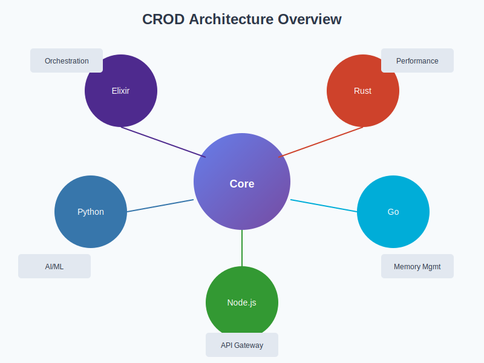

# CROD Phoenix Polyglot – Ultimate README

Ein moderner, produktiver Polyglot-Stack für KI, ML und verteilte Systeme – ohne Marketing, Blockchain oder Quantum-Buzzwords.

## 🚀 Projektstruktur

- `programme/` – Alle Programme, nach Funktionalität sortiert
    - `elixir/` – Elixir-Module & Orchestrator ([README](programme/elixir/README.md))
    - `python/` – Python-Programme ([README](programme/python/README.md))
    - `js/` – JavaScript-Programme ([README](programme/js/README.md))
    - `crod-phoenix/` – Elixir/Phoenix Kern
    - `polyglot/` – Polyglot-Module (z.B. Rust, Go, Node, etc.)
    - `templates/polyglot/` – Polyglot-Templates
- `dokumentation/` – Visuals, technische Doku, ER-Diagramme
    - `phoenix-polyglot-docs/` – Architektur-Grafiken
    - `markdown/` – Technische Doku, ER-Diagramme

## 🏗️ Architektur




## Quickstart

```bash
# Elixir Orchestrator starten
cd programme/crod-phoenix
mix phx.server

# Python-Programme
cd programme/python && python main.py
```

## Dokumentation & Diagramme

- ER-Diagramme: [dokumentation/markdown/erdiagram_core.md](dokumentation/markdown/erdiagram_core.md)
- Technische Übersichten: [dokumentation/markdown/architecture-overview.md](dokumentation/markdown/architecture-overview.md)

## Features
- Polyglotte, verteilte Architektur
- Realistische, produktive Module (kein Blockchain/Quantum)
- Moderne Visuals und Doku

---

**Hinweis:**
Jeder Programm-Ordner enthält ein eigenes README mit Details und Verlinkung zurück zu diesem Haupt-README.

---

*Alle Visuals und Diagramme sind in `dokumentation/phoenix-polyglot-docs/` und direkt hier eingebunden.*
