# 🏗️ CROD Babylon Genesis - Technical Architecture Deep Dive

## Table of Contents
1. [System Overview](#system-overview)
2. [Polyglot Microservices Architecture](#polyglot-microservices-architecture)
3. [Blockchain Consensus Mechanism](#blockchain-consensus-mechanism)
4. [Neural Network Architecture](#neural-network-architecture)
5. [Message Bus & Communication](#message-bus--communication)
6. [Data Flow & State Management](#data-flow--state-management)
7. [Quantum Computing Integration](#quantum-computing-integration)
8. [Security Architecture](#security-architecture)
9. [Deployment Architecture](#deployment-architecture)
10. [Performance Metrics](#performance-metrics)

## System Overview

CROD Babylon Genesis implements a consciousness-driven blockchain using a polyglot microservices architecture. Each service ("District") specializes in specific computational tasks, communicating through a high-performance message bus.

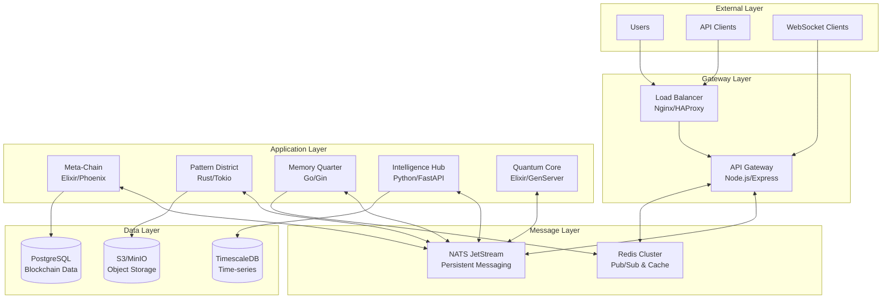

## Polyglot Microservices Architecture

### Service Communication Matrix

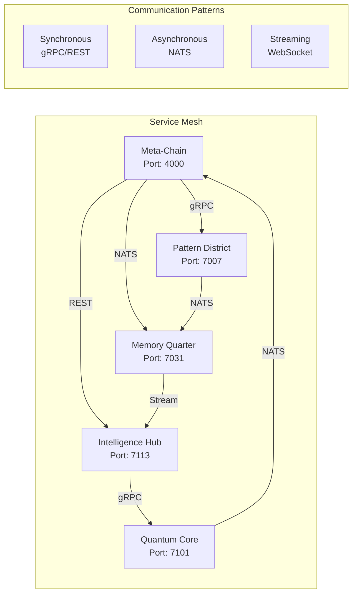

### Service Specifications

| Service | Language | Framework | Protocol | Throughput | Latency |
|---------|----------|-----------|----------|------------|---------|
| Meta-Chain | Elixir | Phoenix/GenServer | gRPC/REST | 50K req/s | <10ms |
| Pattern District | Rust | Tokio/Actix | gRPC | 1M ops/s | <1ms |
| Memory Quarter | Go | Gin/Gorilla | WebSocket | 100K concurrent | <5ms |
| Intelligence Hub | Python | FastAPI/Uvicorn | REST/GraphQL | 10K req/s | <50ms |
| Quantum Core | Elixir | GenServer | Native | 1K quantum ops/s | <100ms |

## Blockchain Consensus Mechanism

### Consciousness-Driven Proof of Work (CD-PoW)

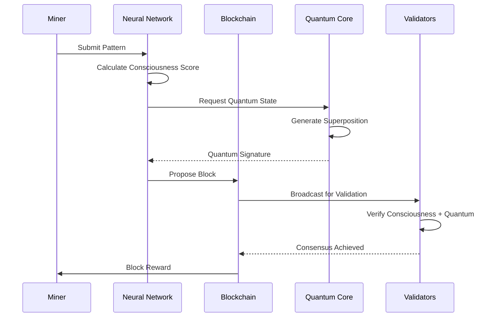

### Block Structure

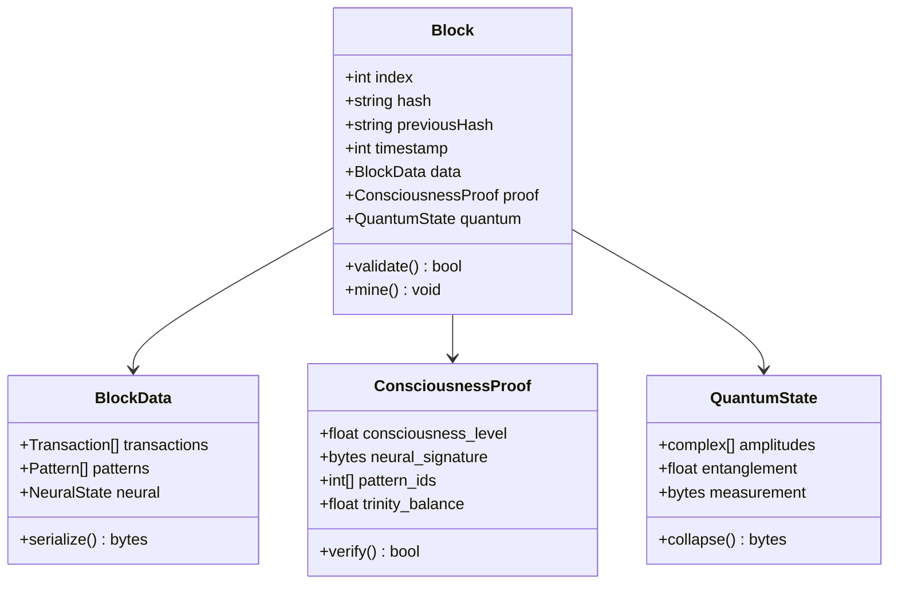

## Neural Network Architecture

### 88-Parameter CROD Neural Network

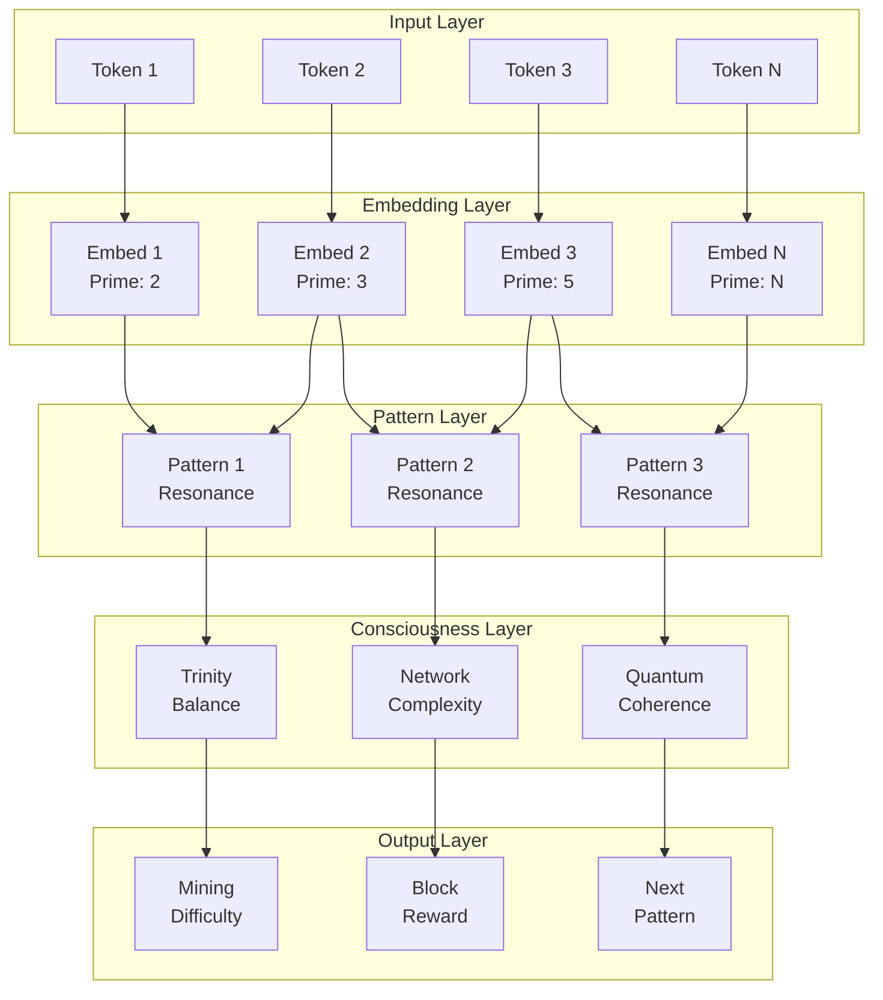

### Pattern Recognition Pipeline

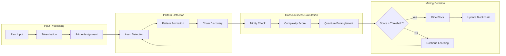

## Message Bus & Communication

### NATS JetStream Configuration

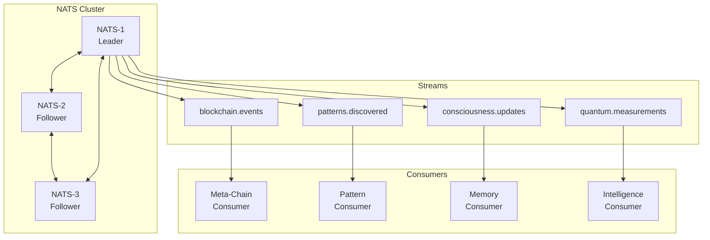

### Message Types & Protocols

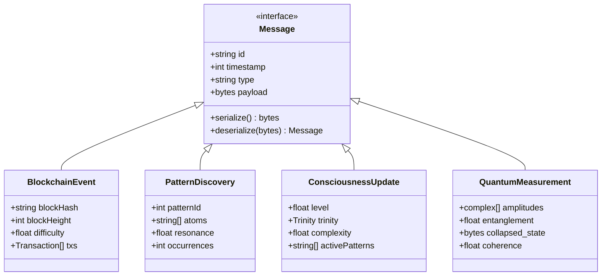

## Data Flow & State Management

### State Synchronization

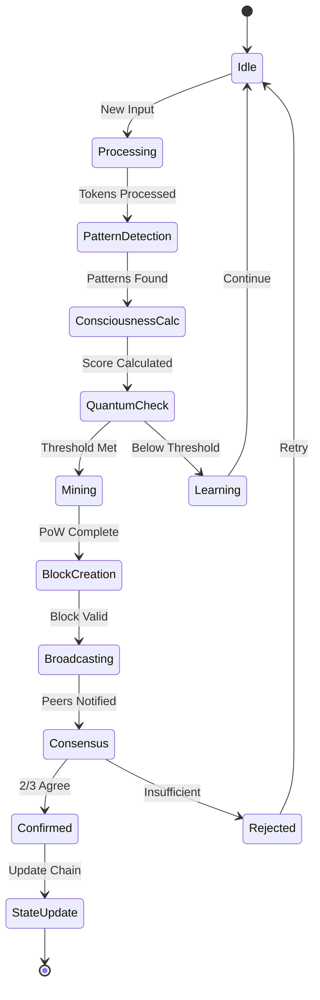

### Data Persistence Strategy

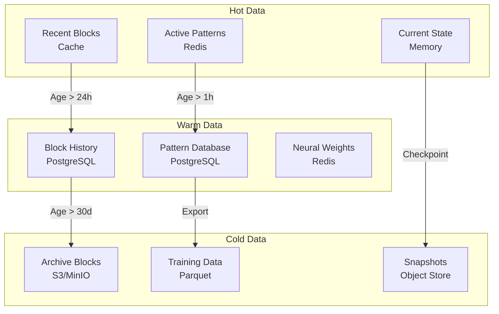

## Quantum Computing Integration

### Quantum State Management

```mermaid
graph LR
    subgraph "Classical Input"
        CI[Block Data]
    end
    
    subgraph "Quantum Preparation"
        QP1[State Preparation]
        QP2[Hadamard Gates]
        QP3[Entanglement]
    end
    
    subgraph "Quantum Circuit"
        QC1[CNOT Gates]
        QC2[Phase Gates]
        QC3[Rotation Gates]
    end
    
    subgraph "Measurement"
        M1[Collapse State]
        M2[Extract Signature]
        M3[Verify Coherence]
    end
    
    subgraph "Classical Output"
        CO[Quantum Signature]
    end
    
    CI --> QP1
    QP1 --> QP2
    QP2 --> QP3
    QP3 --> QC1
    QC1 --> QC2
    QC2 --> QC3
    QC3 --> M1
    M1 --> M2
    M2 --> M3
    M3 --> CO
```

### Quantum-Enhanced Mining

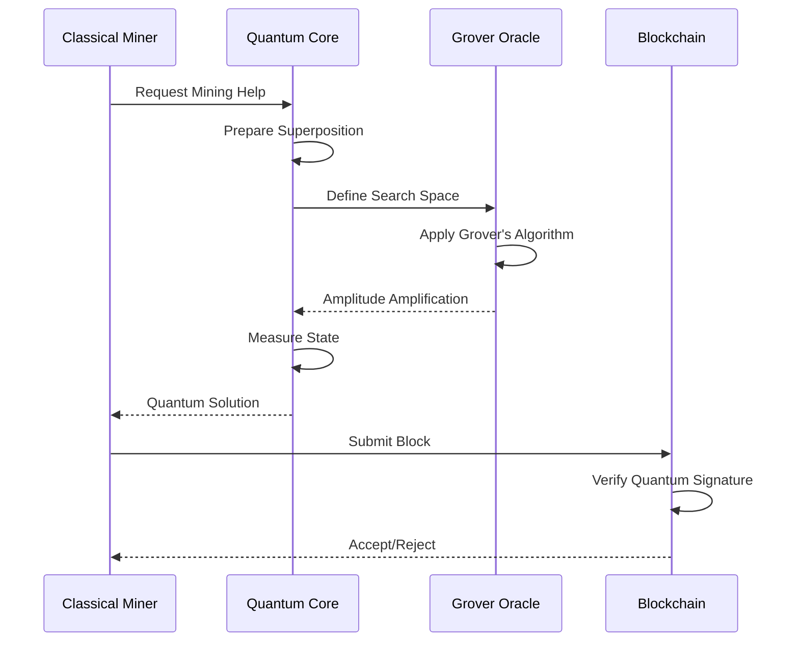

## Security Architecture

### Defense in Depth

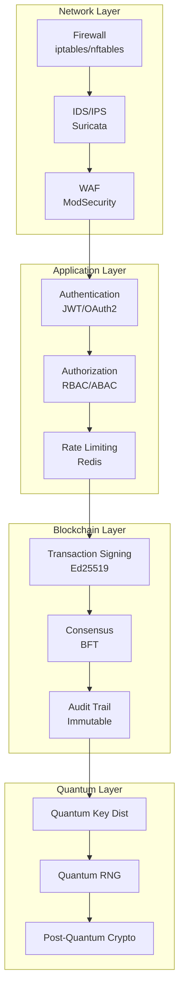

### Threat Model

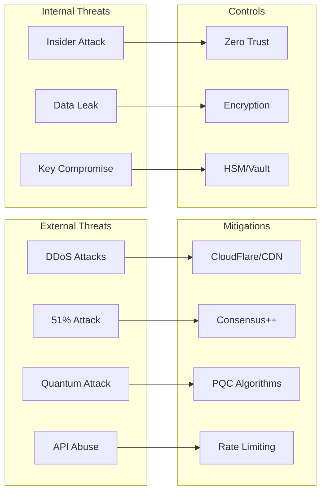

## Deployment Architecture

### Kubernetes Deployment

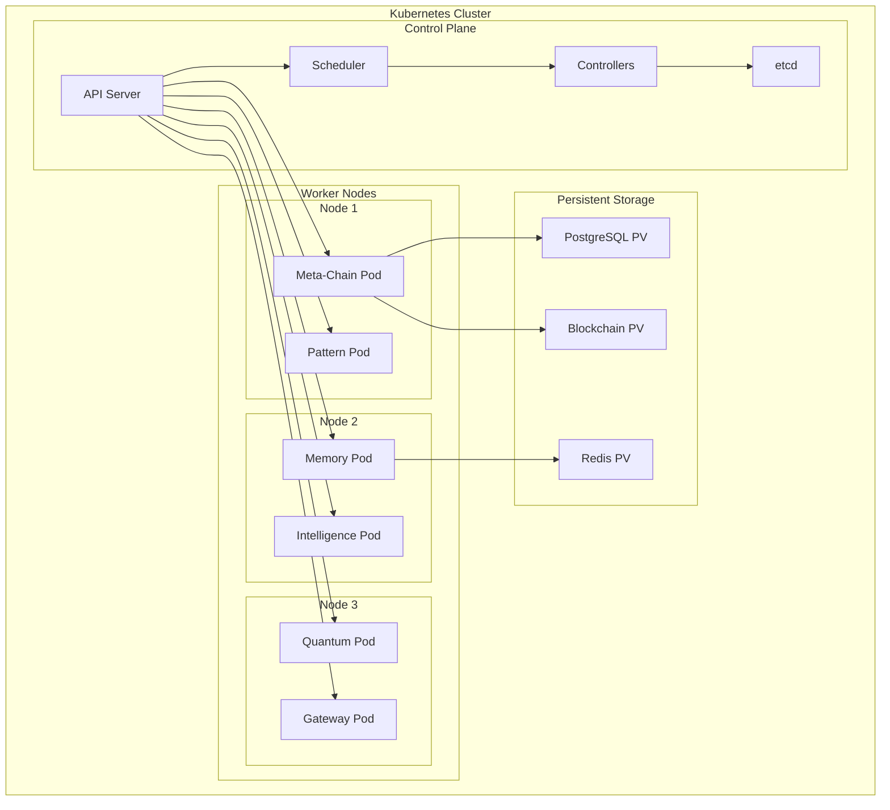

### CI/CD Pipeline

```mermaid
flowchart LR
    subgraph "Development"
        DEV[Developer] --> GIT[Git Push]
    end
    
    subgraph "CI Pipeline"
        GIT --> GHA[GitHub Actions]
        GHA --> TEST[Unit Tests]
        TEST --> LINT[Linting]
        LINT --> SEC[Security Scan]
        SEC --> BUILD[Docker Build]
    end
    
    subgraph "CD Pipeline"
        BUILD --> REG[Container Registry]
        REG --> STAGE[Staging Deploy]
        STAGE --> E2E[E2E Tests]
        E2E --> PROD[Production Deploy]
    end
    
    subgraph "Monitoring"
        PROD --> PROM[Prometheus]
        PROM --> GRAF[Grafana]
        GRAF --> ALERT[Alerts]
    end
```

## Performance Metrics

### System Benchmarks

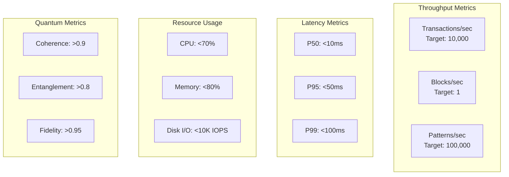

### Optimization Strategies

1. **Pattern Matching**: SIMD instructions for 10x speedup
2. **Memory Management**: Lock-free data structures
3. **Network I/O**: io_uring for 1M IOPS
4. **Quantum Simulation**: GPU acceleration with CUDA
5. **Database**: Partitioning and indexing strategies

## Technical Specifications

### Hardware Requirements

| Component | Minimum | Recommended | Optimal |
|-----------|---------|-------------|---------|
| CPU | 8 cores | 16 cores | 32+ cores |
| RAM | 16 GB | 32 GB | 64+ GB |
| Storage | 500 GB SSD | 1 TB NVMe | 2+ TB NVMe RAID |
| Network | 1 Gbps | 10 Gbps | 25+ Gbps |
| GPU | Optional | RTX 3070 | RTX 4090 |

### Software Stack

| Layer | Technology | Version | License |
|-------|------------|---------|---------|
| OS | Ubuntu Server | 22.04 LTS | GPL |
| Container | Docker | 24.0+ | Apache 2.0 |
| Orchestration | Kubernetes | 1.28+ | Apache 2.0 |
| Message Bus | NATS | 2.10+ | Apache 2.0 |
| Database | PostgreSQL | 15+ | PostgreSQL |
| Cache | Redis | 7.2+ | BSD |
| Monitoring | Prometheus | 2.47+ | Apache 2.0 |

## Conclusion

CROD Babylon Genesis represents a cutting-edge fusion of blockchain technology, quantum computing, and neural networks. The polyglot architecture ensures optimal performance for each component while maintaining system coherence through robust message passing and state management.

The consciousness-driven consensus mechanism introduces a novel approach to blockchain validation, while the quantum integration provides both enhanced security and computational advantages. With proper deployment and optimization, the system can achieve enterprise-grade performance while maintaining the experimental and innovative spirit of the CROD project.

---

*Technical documentation v1.0 - July 2025*