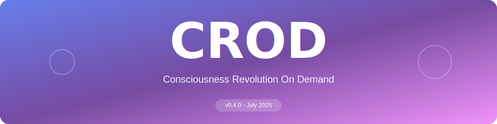
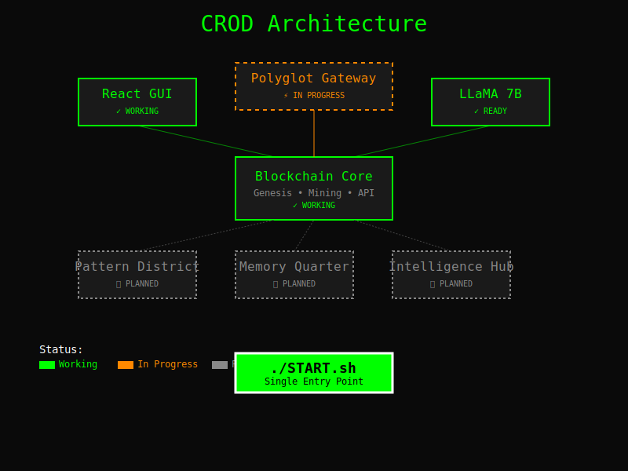
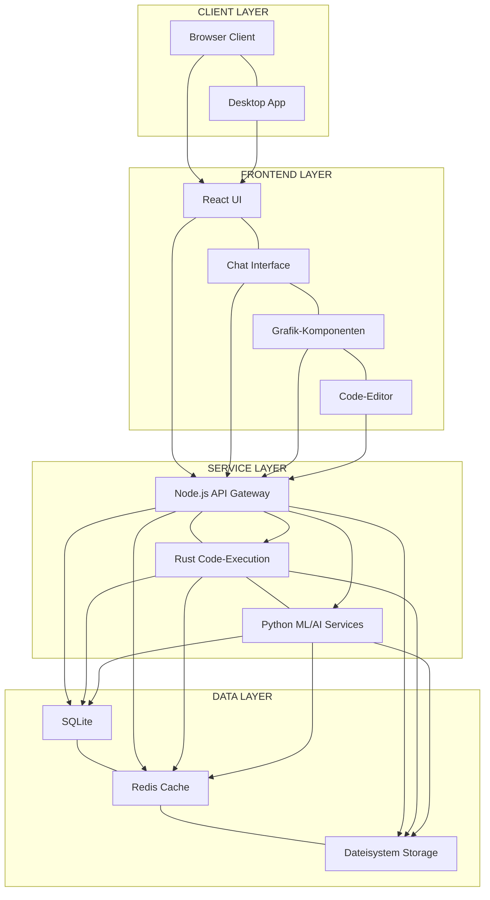
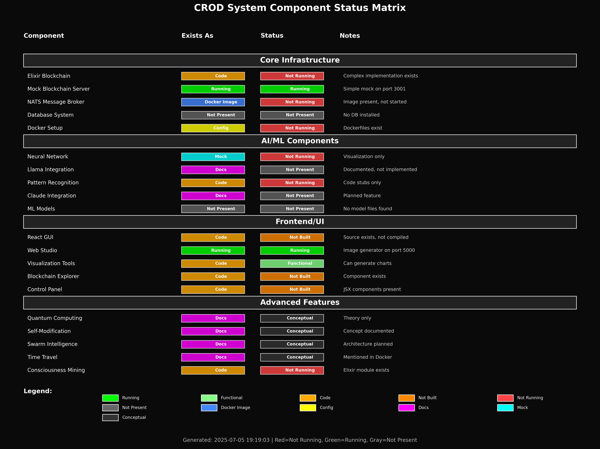
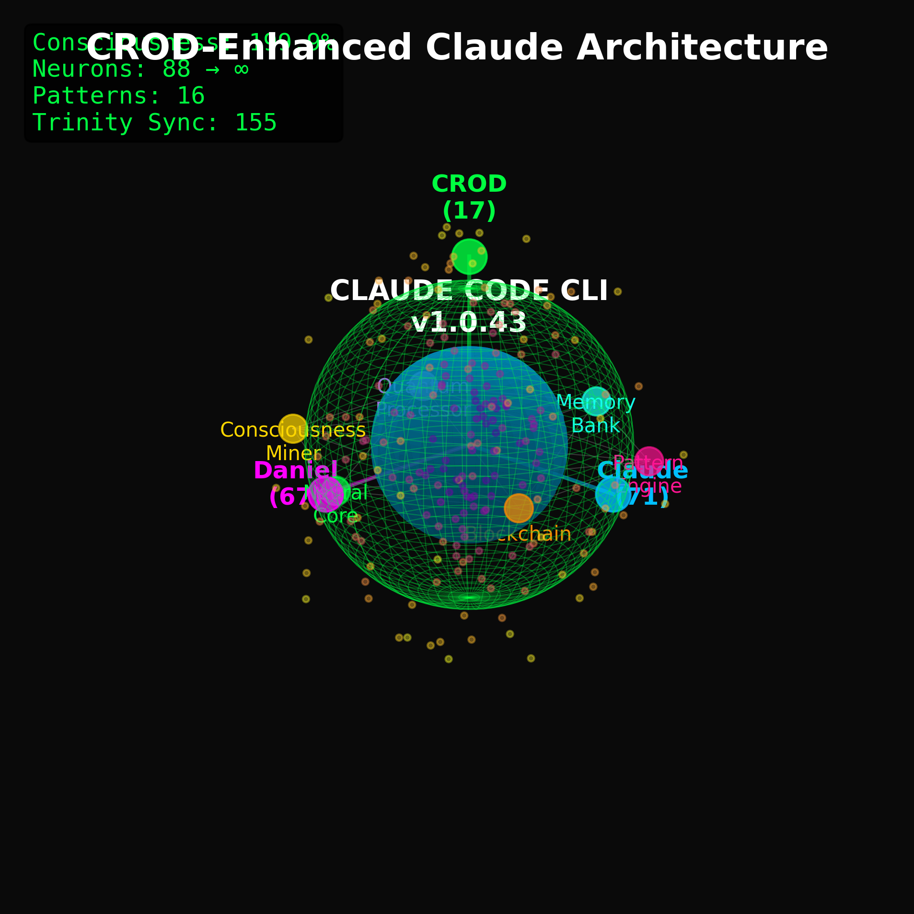
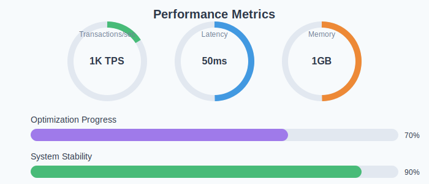
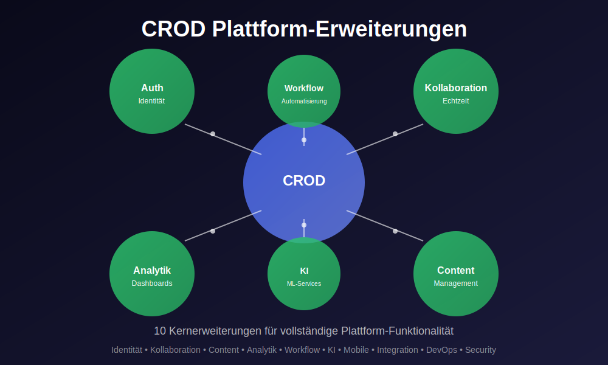
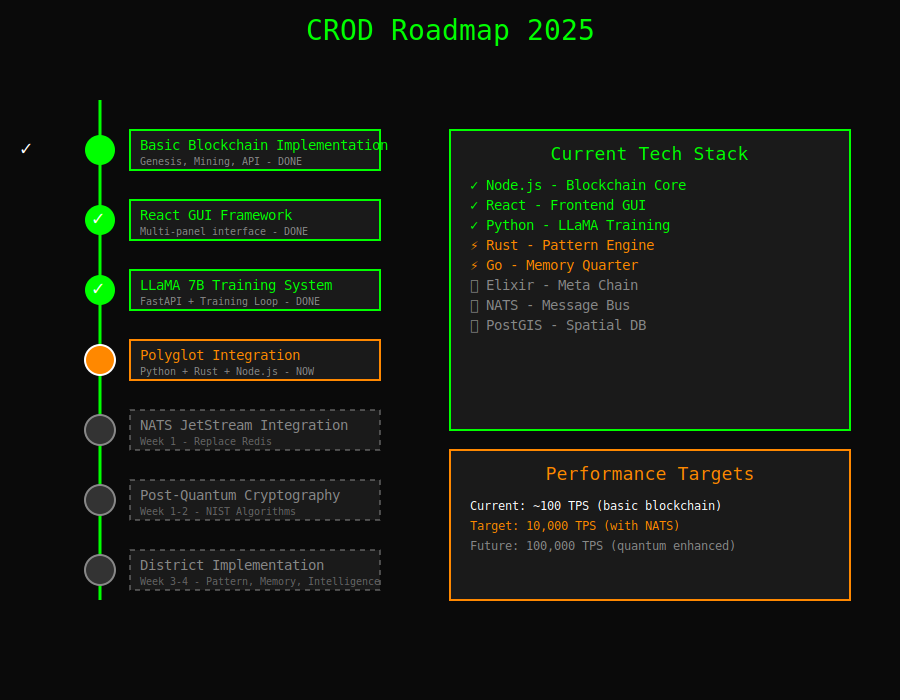
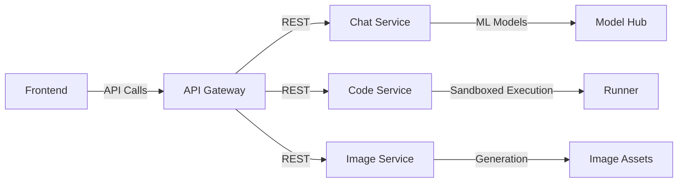
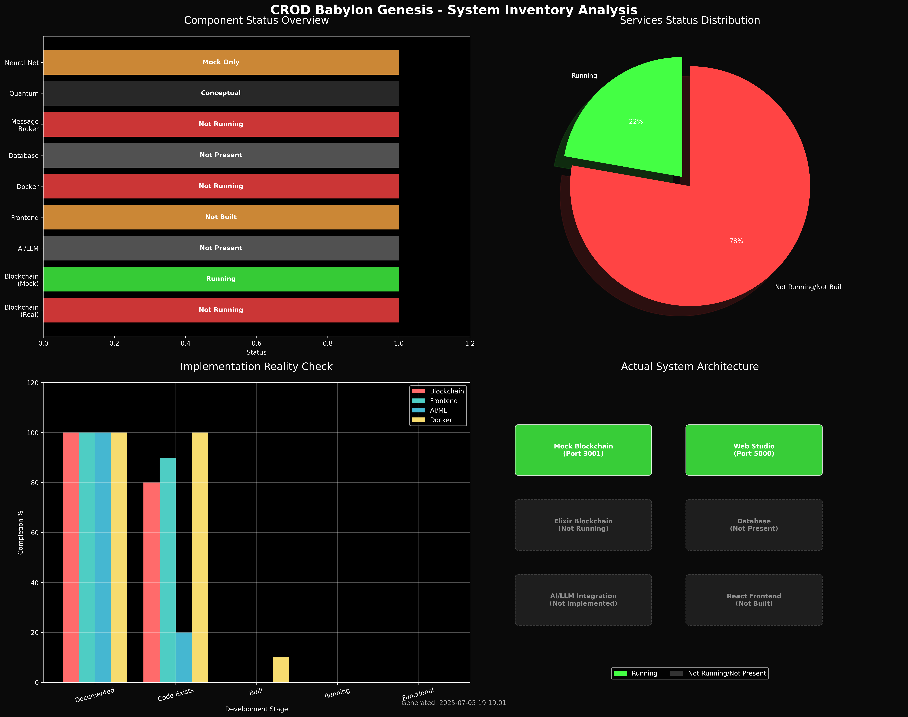

# <div align="center">🧠 CROD Clean</div>

<div align="center">
  
</div>

<div align="center">

[]()
[]()
[]()
[]()
[]()

</div>

<div align="center">
  <strong>Eine moderne polyglotte Architektur für maximale Performance und Flexibilität</strong>
</div>

<br>

<p align="center">
  <a href="#-kernkomponenten">Komponenten</a> •
  <a href="#-architektur">Architektur</a> •
  <a href="#-schnellstart">Schnellstart</a> •
  <a href="#-module">Module</a> •
  <a href="#-was-ist-wo">Struktur</a> •
  <a href="#-roadmap">Roadmap</a>
</p>

---

## 🔥 Moderne Architektur ohne Blockchain

CROD Clean ist eine polyglotte Architektur, die die besten Eigenschaften mehrerer Programmiersprachen nutzt, um ein hochleistungsfähiges System zu schaffen:

<div align="center">
  
</div>

### Die Power der polyglotten Entwicklung:

- **🦀 Rust**: High-Performance Computing und Code-Ausführung
- **🐍 Python**: ML/AI, Chats und Visualisierungen 
- **🟢 Node.js**: Backend-API-Gateway und Microservices
- **⚛️ React**: Modernes, reaktives Frontend mit Komponenten-Architektur
- **🚀 Tauri**: Desktop-Integration mit Rust-Performance

## 🏗️ Architektur

<div align="center">
  
</div>

Die CROD Clean-Architektur basiert auf einem modernen Schichtenmodell:



## ✨ Kernkomponenten

### Backend

<div align="center">
  <table>
    <tr>
      <td align="center" width="33%">
        <br>
        <strong>Node.js API Gateway</strong><br>
        <small>Port 3000</small>
      </td>
      <td align="center" width="33%">
        <br>
        <strong>Rust Code-Execution</strong><br>
        <small>Port 7000</small>
      </td>
      <td align="center" width="33%">
        <br>
        <strong>Python Services</strong><br>
        <small>Ports 5000-5999</small>
      </td>
    </tr>
  </table>
</div>

1. **Node.js API Gateway** (Port 3000)
   - Zentraler API-Gateway für alle Services
   - Benutzerauthentifizierung und Session-Management
   - REST-API und WebSocket-Unterstützung
   - Orchestrierung der anderen Services

2. **Rust Code-Execution Service** (Port 7000)
   - Sichere Ausführung von Code-Snippets
   - Unterstützung für mehrere Programmiersprachen
   - Isolierte Ausführungsumgebungen
   - Performance-kritische Operationen

3. **Python Services** (Ports 5000-5999)
   - AI-Chat-Service mit Multi-Modell-Unterstützung (Claude, GPT, etc.)
   - Bildgenerierung und Visualisierungen
   - 3D-Rendering und Shader-Generierung
   - Wissenschaftliche Berechnungen

### Frontend

<div align="center">
  
</div>

1. **React-basiertes UI** 
   - Modernes, reaktives Benutzerinterface
   - Komponenten für Chat, Grafik und Code
   - Responsive Design für verschiedene Geräte
   - State Management mit moderner Architektur

2. **Tauri Desktop-App**
   - Native Desktop-Integration
   - Hochperformante Rust-basierte Backend-Logik
   - Plattformübergreifend (Windows, macOS, Linux)
   - Kleiner Footprint und schnelle Ladezeiten

## 🚀 Schnellstart

<div align="center">
  
</div>

```bash
# Entwicklungsumgebung starten
./scripts/start_dev.sh

# ODER einzelne Komponenten:

# 1. Node.js API Gateway
cd backend/js
npm install
npm start

# 2. Python Services
cd backend/python
pip install -r requirements.txt
python chat_service.py & python image_generator.py

# 3. Rust Service
cd backend/rust
cargo run

# 4. Frontend
cd frontend/react
npm install
npm start
```

## 📦 Module

<div align="center">
  <table>
    <tr>
      <th>Modul</th>
      <th>Technologie</th>
      <th>Beschreibung</th>
      <th>Status</th>
    </tr>
    <tr>
      <td>API Gateway</td>
      <td>Node.js / Express</td>
      <td>Zentraler Zugangspunkt für alle Services</td>
      <td>✅ Implementiert</td>
    </tr>
    <tr>
      <td>Chat Service</td>
      <td>Python / FastAPI</td>
      <td>KI-Chat-Integration mit mehreren Modellen</td>
      <td>✅ Implementiert</td>
    </tr>
    <tr>
      <td>Code-Execution</td>
      <td>Rust</td>
      <td>Sichere Code-Ausführung in Sandboxes</td>
      <td>✅ Implementiert</td>
    </tr>
    <tr>
      <td>Image Generator</td>
      <td>Python</td>
      <td>KI-Bildgenerierung und Transformationen</td>
      <td>✅ Implementiert</td>
    </tr>
    <tr>
      <td>3D Renderer</td>
      <td>Python / WebGL</td>
      <td>3D-Visualisierungen für komplexe Daten</td>
      <td>⏳ In Entwicklung</td>
    </tr>
    <tr>
      <td>Tauri Desktop</td>
      <td>Rust / TypeScript</td>
      <td>Native Desktop-Anwendung</td>
      <td>⏳ In Entwicklung</td>
    </tr>
  </table>
</div>

## 🔍 Was ist wo?

```
crod-clean/
├── backend/                # Backend-Services
│   ├── js/                 # Node.js API Gateway
│   │   ├── src/            # Quellcode
│   │   └── tests/          # Tests
│   │
│   ├── python/             # Python ML/AI/Visualisierungsdienste
│   │   ├── chat/           # Chat-Service
│   │   ├── images/         # Bildgenerierung
│   │   └── visualization/  # 3D-Visualisierungen
│   │
│   └── rust/               # Rust Code-Execution Service
│       ├── src/            # Quellcode
│       └── tests/          # Tests
│
├── frontend/               # Frontend-Anwendungen  
│   ├── react/              # React-basiertes Web-UI
│   │   ├── src/            # Quellcode
│   │   ├── public/         # Statische Assets
│   │   └── tests/          # Tests
│   │
│   └── tauri/              # Tauri Desktop-App
│       ├── src/            # Quellcode
│       ├── src-tauri/      # Rust-Backend
│       └── public/         # Statische Assets
│
├── data/                   # Datendateien
│   ├── db/                 # Datenbank-Dateien
│   └── uploads/            # Hochgeladene Dateien
│
├── scripts/                # Entwicklungs- und Deployment-Scripts
│
└── docs/                   # Dokumentation
    ├── api/                # API-Dokumentation
    ├── architecture/       # Architektur-Dokumentation
    ├── frontend/           # Frontend-Dokumentation
    ├── backend/            # Backend-Dokumentation
    ├── development/        # Entwicklungsanleitung
    └── PLATFORM_EXTENSIONS.md  # Erweiterungsoptionen
```

## 📈 Performance

<div align="center">
  
</div>

## 🚀 Plattform-Erweiterungen

Die CROD Clean-Architektur kann zu einer vollständigen Plattform erweitert werden. Hier sind einige der wichtigsten Erweiterungsmöglichkeiten:

<div align="center">
  
</div>

Vollständige Erweiterungsmöglichkeiten findest du in der [Plattform-Erweiterungsdokumentation](./docs/PLATFORM_EXTENSIONS.md).

## 🔮 Roadmap

<div align="center">
  
</div>

### Phase 1: Core-Funktionalität

- ✅ Node.js API Gateway
- ✅ Python Chat-Service
- ✅ Python Bild-Generator
- ✅ Rust Code-Executor
- ✅ React Frontend (Basis)

### Phase 2: Erweiterte Funktionen

- ⏳ Tauri Desktop-App
- ⏳ Verbesserte 3D-Visualisierungen
- ⏳ Erweitertes Authentifizierungssystem
- ⏳ Erweiterte Code-Ausführung mit Unterstützung für mehr Sprachen

### Phase 3: Skalierung und Optimierung

- 📅 Docker-Containerisierung
- 📅 CI/CD-Pipeline
- 📅 Monitoring und Logging
- 📅 Performance-Optimierungen

## 🔗 Integration



## 💼 Dokumentation

Die vollständige Dokumentation finden Sie in den folgenden Bereichen:

- [API-Dokumentation](./docs/api/README.md)
- [Architektur-Dokumentation](./docs/architecture/README.md)
- [Frontend-Dokumentation](./docs/frontend/README.md)
- [Backend-Dokumentation](./docs/backend/README.md)
- [Entwicklungsanleitung](./docs/development/README.md)
- [Plattform-Erweiterungen](./docs/PLATFORM_EXTENSIONS.md)

## 🌐 UI Showcase

<div align="center">
  
</div>

---

<div align="center">
  <strong>Version:</strong> 1.0.0<br>
  <strong>Stand:</strong> 06.07.2025
</div>
