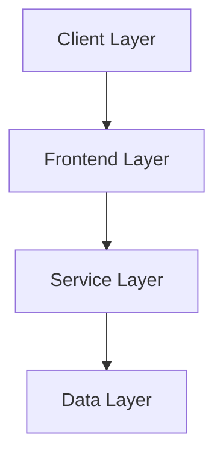
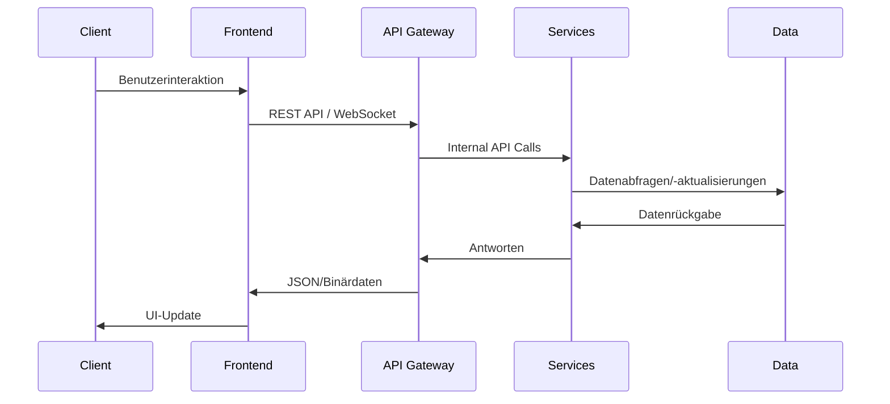

# 🏗️ Architektur-Dokumentation

  

## Übersicht

Die CROD Clean-Architektur ist eine moderne, polyglotte Architektur, die verschiedene Programmiersprachen und Technologien kombiniert, um eine optimale Leistung und Flexibilität zu erreichen. Diese Dokumentation beschreibt die Architektur im Detail.

## Schichten-Architektur

Die CROD Clean-Architektur besteht aus vier Hauptschichten:

### Client Layer

Die Client-Schicht umfasst alle Zugriffspunkte für Endbenutzer:

- Web-Browser
- Desktop-Anwendung (Tauri)
- Potenzielle mobile Anwendungen

### Frontend Layer

Die Frontend-Schicht umfasst alle Benutzeroberflächen:

- React-basiertes Web-UI
- Tauri-Desktop-Anwendung
- Gemeinsame Komponenten:
  - Chat-Interface
  - Code-Editor
  - Visualisierungskomponenten

### Service Layer

Die Service-Schicht besteht aus verschiedenen Microservices:

- Node.js API Gateway
- Rust Code-Execution Service
- Python Services:
  - Chat-Service
  - Image-Service
  - Visualization-Service

### Data Layer

Die Daten-Schicht umfasst alle Datenquellen:

- SQLite Datenbank
- Redis Cache (optional)
- Dateisystem-Storage

## Kommunikation zwischen den Schichten

## Polyglotte Architektur

CROD Clean nutzt verschiedene Programmiersprachen für optimale Leistung:

- **Rust**: Für performance-kritische Komponenten (Code-Ausführung)
- **Python**: Für ML/AI und Datenvisualisierungen
- **JavaScript/TypeScript**: Für Web-Frontend und API-Gateway
- **SQL**: Für Datenpersistenz

## Microservice-Architektur

Jeder Service ist als eigenständiger Microservice implementiert:

- Unabhängiges Deployment
- Eigene Datenquelle (wenn erforderlich)
- Klare API-Grenzen
- Skalierbarkeit einzelner Services

## Kommunikationsprotokolle

Die Services kommunizieren über folgende Protokolle:

- REST API (primär)
- WebSockets (für Echtzeit-Updates)
- Internal API Calls (zwischen Services)

## Sicherheitsarchitektur

Die CROD Clean-Architektur implementiert mehrere Sicherheitsebenen:

- JWT-basierte Authentifizierung
- CORS-Konfiguration
- Sandboxed Code-Execution
- Input-Validierung
- Rate Limiting

## Deployment-Architektur

Die CROD Clean-Architektur kann auf verschiedene Weisen deployed werden:

- Lokales Development Setup
- Docker-Container (einzeln oder via Docker Compose)
- Potenzielle Cloud-Deployments

## Erweiterbarkeit

Die modulare Architektur ermöglicht einfache Erweiterungen:

- Neue Services können hinzugefügt werden
- Bestehende Services können erweitert werden
- Neue Clients können integriert werden
