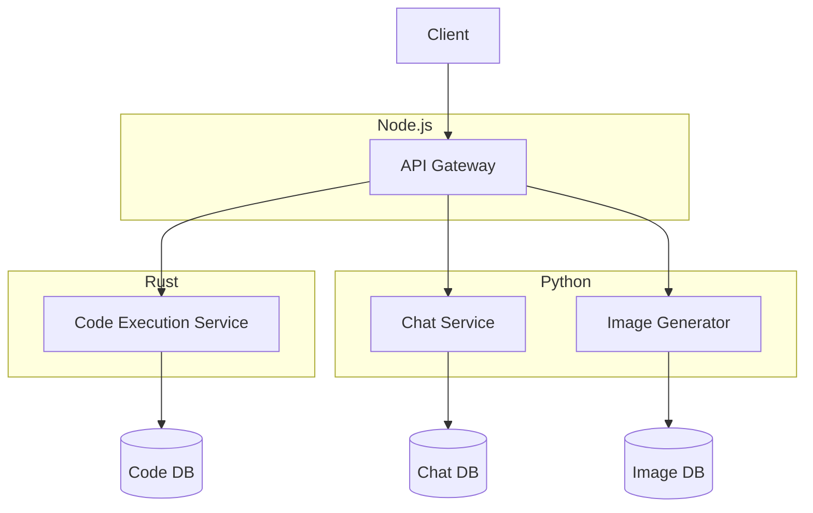

# 🔧 Backend-Dokumentation

<div align="center">
  
</div>

## Übersicht

Das CROD Clean Backend ist eine polyglotte Microservice-Architektur, die verschiedene Programmiersprachen für optimale Leistung kombiniert. Diese Dokumentation beschreibt die Backend-Architektur, Services und Entwicklungspraktiken.

## Service-Architektur

Das Backend besteht aus drei Hauptservices:

1. **Node.js API Gateway** (Port 3000)
2. **Rust Code-Execution Service** (Port 7000)
3. **Python Services** (Ports 5000-5999)



## Node.js API Gateway

Der API Gateway dient als zentraler Einstiegspunkt für alle Client-Anfragen und orchestriert die Kommunikation zwischen Client und Services.

### Technologiestack

- **Express.js**: Web-Framework
- **TypeScript**: Typisierte JavaScript-Erweiterung
- **JWT**: Authentifizierung
- **Socket.io**: WebSocket-Kommunikation

### Hauptfunktionen

- Authentifizierung und Autorisierung
- Routing zu entsprechenden Microservices
- Rate Limiting und Caching
- WebSocket-Kommunikation
- Logging und Monitoring

### Codestruktur

```
backend/js/
├── src/
│   ├── controllers/    # Request Handler
│   ├── middleware/     # Express Middleware
│   ├── routes/         # API Routes
│   ├── services/       # Business Logic
│   ├── utils/          # Hilfsfunktionen
│   ├── models/         # Datenmodelle
│   └── app.ts          # Express App
├── tests/              # Tests
├── package.json        # Dependencies
└── tsconfig.json       # TypeScript-Konfiguration
```

### API-Beispiel

```typescript
// routes/chat.ts
import { Router } from 'express';
import { authenticate } from '../middleware/auth';
import { getMessages, sendMessage } from '../controllers/chat';

const router = Router();

router.get('/messages', authenticate, getMessages);
router.post('/messages', authenticate, sendMessage);

export default router;
```

## Rust Code-Execution Service

Der Code-Execution Service ermöglicht die sichere Ausführung von Code in verschiedenen Programmiersprachen.

### Technologiestack

- **Rust**: Systemsprache
- **Actix-Web**: Web-Framework
- **Docker**: Container für Code-Ausführung
- **SQLite**: Lokale Datenbank

### Hauptfunktionen

- Sichere Code-Ausführung in isolierten Umgebungen
- Unterstützung für mehrere Programmiersprachen
- Ressourcenlimitierung
- Code-Analyse und Validierung

### Codestruktur

```
backend/rust/
├── src/
│   ├── handlers/      # Request Handler
│   ├── models/        # Datenmodelle
│   ├── executors/     # Code-Execution-Logic
│   ├── utils/         # Hilfsfunktionen
│   └── main.rs        # Hauptanwendung
├── tests/             # Tests
└── Cargo.toml         # Dependencies
```

### API-Beispiel

```rust
// handlers/code.rs
use actix_web::{web, HttpResponse};
use serde::{Deserialize, Serialize};

#[derive(Deserialize)]
pub struct CodeRequest {
    language: String,
    code: String,
    timeout: Option<u32>,
}

#[derive(Serialize)]
pub struct CodeResponse {
    output: String,
    error: Option<String>,
    execution_time: f64,
}

pub async fn execute_code(
    data: web::Json<CodeRequest>,
) -> HttpResponse {
    // Code-Ausführungslogik
    // ...
    
    HttpResponse::Ok().json(CodeResponse {
        output: "Hello, World!".to_string(),
        error: None,
        execution_time: 0.001,
    })
}
```

## Python Services

Die Python-Services umfassen AI-basierte Funktionen wie Chat und Bildgenerierung.

### Technologiestack

- **Python**: Programmiersprache
- **FastAPI**: Web-Framework
- **SQLAlchemy**: ORM
- **PyTorch/TensorFlow**: ML-Frameworks
- **Pillow**: Bildverarbeitung

### Hauptfunktionen

#### Chat-Service
- Integration mit AI-Modellen (Claude, GPT, etc.)
- Kontextmanagement
- Konversationspersistenz

#### Image-Service
- KI-Bildgenerierung
- Bildtransformationen
- Bildpersistenz

### Codestruktur

```
backend/python/
├── chat/
│   ├── app.py         # FastAPI-Anwendung
│   ├── models.py      # Datenmodelle
│   ├── services.py    # Business Logic
│   └── routes.py      # API-Routen
├── images/
│   ├── app.py         # FastAPI-Anwendung
│   ├── models.py      # Datenmodelle
│   ├── services.py    # Business Logic
│   └── routes.py      # API-Routen
└── requirements.txt   # Dependencies
```

### API-Beispiel

```python
# chat/routes.py
from fastapi import APIRouter, Depends, HTTPException
from typing import List
from .models import Message, MessageCreate
from .services import ChatService

router = APIRouter()
chat_service = ChatService()

@router.get("/messages", response_model=List[Message])
async def get_messages():
    return chat_service.get_messages()

@router.post("/messages", response_model=Message)
async def create_message(message: MessageCreate):
    return chat_service.create_message(message)
```

## Service-Kommunikation

Die Services kommunizieren über HTTP/REST und können bei Bedarf auch auf Message Queues oder gRPC umgestellt werden.

### Kommunikationsbeispiel

```javascript
// Node.js API Gateway zu Python Chat-Service
const sendMessageToChatService = async (message) => {
  try {
    const response = await fetch('http://localhost:5000/api/messages', {
      method: 'POST',
      headers: {
        'Content-Type': 'application/json',
      },
      body: JSON.stringify(message),
    });
    return await response.json();
  } catch (error) {
    console.error('Error sending message to chat service:', error);
    throw error;
  }
};
```

## Datenbank

Jeder Service verwendet seine eigene Datenbank für optimale Leistung und Isolation.

### Datenbankschema

#### Chat-Service

```sql
CREATE TABLE messages (
  id INTEGER PRIMARY KEY,
  user_id INTEGER NOT NULL,
  content TEXT NOT NULL,
  timestamp DATETIME DEFAULT CURRENT_TIMESTAMP,
  model TEXT NOT NULL
);
```

#### Code-Service

```sql
CREATE TABLE executions (
  id INTEGER PRIMARY KEY,
  user_id INTEGER NOT NULL,
  language TEXT NOT NULL,
  code TEXT NOT NULL,
  output TEXT,
  error TEXT,
  execution_time REAL,
  timestamp DATETIME DEFAULT CURRENT_TIMESTAMP
);
```

#### Image-Service

```sql
CREATE TABLE images (
  id INTEGER PRIMARY KEY,
  user_id INTEGER NOT NULL,
  prompt TEXT NOT NULL,
  style TEXT NOT NULL,
  url TEXT NOT NULL,
  timestamp DATETIME DEFAULT CURRENT_TIMESTAMP
);
```

## Sicherheit

### Authentifizierung

Die Authentifizierung erfolgt über den API Gateway mittels JWT:

```javascript
// middleware/auth.js
const authenticate = (req, res, next) => {
  const token = req.headers.authorization?.split(' ')[1];
  
  if (!token) {
    return res.status(401).json({ error: 'Authentication required' });
  }
  
  try {
    const decoded = jwt.verify(token, process.env.JWT_SECRET);
    req.user = decoded;
    next();
  } catch (error) {
    return res.status(401).json({ error: 'Invalid token' });
  }
};
```

### Sichere Code-Ausführung

Der Rust Code-Execution Service führt Code in isolierten Docker-Containern aus:

```rust
// executors/docker.rs
pub fn execute_in_container(language: &str, code: &str, timeout: u32) -> Result<Output, Error> {
    // Container erstellen mit Ressourcenbeschränkungen
    // Code in Container kopieren
    // Code ausführen
    // Ergebnis zurückgeben
}
```

## Fehlerbehandlung

Alle Services implementieren konsistente Fehlerbehandlung:

- HTTP-Statuscodes für API-Fehler
- Detaillierte Fehlermeldungen für Entwickler
- Abstrakte Fehlermeldungen für Endbenutzer
- Zentrales Logging

## Logging und Monitoring

Alle Services implementieren Logging:

```javascript
// Node.js
const logger = winston.createLogger({
  level: 'info',
  format: winston.format.json(),
  transports: [
    new winston.transports.File({ filename: 'error.log', level: 'error' }),
    new winston.transports.File({ filename: 'combined.log' }),
  ],
});
```

```rust
// Rust
use log::{info, error};

info!("Code execution started");
match execute_code(&language, &code, timeout) {
    Ok(output) => info!("Code execution completed in {}ms", output.execution_time),
    Err(e) => error!("Code execution failed: {}", e),
}
```

```python
# Python
import logging

logging.basicConfig(
    level=logging.INFO,
    format='%(asctime)s - %(name)s - %(levelname)s - %(message)s',
    handlers=[
        logging.FileHandler("chat_service.log"),
        logging.StreamHandler()
    ]
)
logger = logging.getLogger(__name__)
```

## Erweiterbarkeit

Die modulare Architektur ermöglicht einfache Erweiterungen:

- Neue Services können hinzugefügt werden
- Bestehende Services können erweitert werden
- Neue Datenquellen können integriert werden
