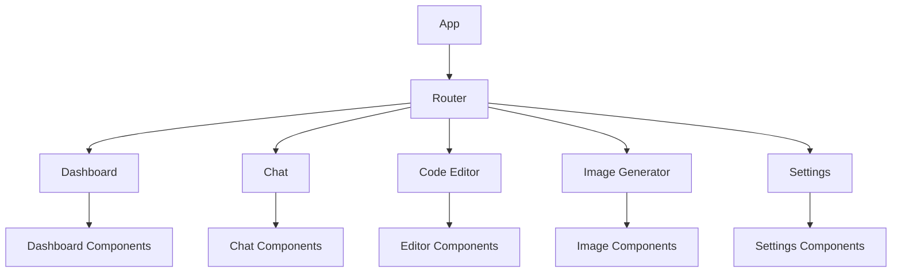

# 🎨 Frontend-Dokumentation

<div align="center">
  
</div>

## Übersicht

Das CROD Clean Frontend ist eine moderne, reaktive Anwendung, die auf React und TypeScript basiert. Diese Dokumentation beschreibt die Frontend-Architektur, Komponenten und Entwicklungspraktiken.

## Architektur

Das Frontend besteht aus zwei Hauptteilen:

1. **Web-Anwendung** (React/TypeScript)
2. **Desktop-Anwendung** (Tauri/Rust/React)

### Web-Anwendung

Die Web-Anwendung ist eine Single-Page-Application (SPA), die mit React und TypeScript entwickelt wurde.



### Desktop-Anwendung

Die Desktop-Anwendung basiert auf Tauri, einem Framework für die Erstellung von Desktop-Anwendungen mit Web-Technologien und Rust.

```
frontend/tauri/
├── src/               # TypeScript/React Frontend
├── src-tauri/         # Rust Backend
│   ├── src/           # Rust-Quellcode
│   ├── Cargo.toml     # Rust-Abhängigkeiten
│   └── tauri.conf.json # Tauri-Konfiguration
└── public/            # Statische Assets
```

## Komponenten

### Gemeinsame Komponenten

- **Header**: Navigationleiste und Benutzermenü
- **Sidebar**: Hauptnavigation
- **Footer**: Copyright und Links
- **Modal**: Wiederverwendbare Modal-Komponente
- **Button**: Standardisierte Button-Komponente
- **Input**: Standardisierte Input-Komponente
- **Card**: Container-Komponente für Inhalte

### Modulspezifische Komponenten

#### Dashboard

- **StatCard**: Anzeige von Statistiken
- **ActivityFeed**: Aktivitäten des Benutzers
- **QuickActions**: Schnellzugriffsaktionen

#### Chat

- **ChatWindow**: Hauptchat-Fenster
- **MessageList**: Liste der Chat-Nachrichten
- **MessageInput**: Eingabefeld für neue Nachrichten
- **ModelSelector**: Auswahl des AI-Modells

#### Code Editor

- **CodeEditor**: Monaco-basierter Code-Editor
- **LanguageSelector**: Auswahl der Programmiersprache
- **OutputWindow**: Anzeige der Code-Ausführungsergebnisse
- **ConsoleOutput**: Anzeige der Konsolenausgabe

#### Image Generator

- **PromptInput**: Eingabe für die Bildgenerierung
- **StyleSelector**: Auswahl des Bildstils
- **ImageGallery**: Anzeige generierter Bilder
- **ImageControls**: Steuerelemente für Bildmanipulation

## State Management

Das Frontend verwendet React Context API und Hooks für das State Management:

- **AuthContext**: Verwaltet den Authentifizierungsstatus
- **ChatContext**: Verwaltet Chat-Nachrichten und -Status
- **CodeContext**: Verwaltet Code und Ausführungsergebnisse
- **ImageContext**: Verwaltet generierte Bilder

## API-Integration

Das Frontend kommuniziert mit dem Backend über:

- **REST API**: Für CRUD-Operationen
- **WebSockets**: Für Echtzeit-Updates

```javascript
// Beispiel für API-Integration
const fetchMessages = async () => {
  try {
    const response = await fetch('http://localhost:3000/api/chat/messages', {
      headers: {
        'Authorization': `Bearer ${token}`
      }
    });
    const data = await response.json();
    setMessages(data);
  } catch (error) {
    console.error('Error fetching messages:', error);
  }
};
```

## Theming und Styling

Das Frontend verwendet:

- **CSS Modules**: Für komponentenspezifisches Styling
- **CSS Variables**: Für globale Designkonstanten
- **Dark/Light Mode**: Unterstützung für helles und dunkles Design

```css
:root {
  --primary-color: #4a6cf7;
  --secondary-color: #f7774a;
  --background-color: #ffffff;
  --text-color: #333333;
}

[data-theme="dark"] {
  --background-color: #1a1a1a;
  --text-color: #f5f5f5;
}
```

## Responsive Design

Das Frontend ist vollständig responsiv und unterstützt verschiedene Bildschirmgrößen:

- **Desktop**: > 1024px
- **Tablet**: 768px - 1024px
- **Mobile**: < 768px

```css
/* Beispiel für Responsive Design */
.container {
  width: 100%;
  padding: 20px;
}

@media (max-width: 768px) {
  .container {
    padding: 10px;
  }
}
```

## Barrierefreiheit

Das Frontend folgt den WCAG 2.1 AA-Richtlinien:

- Semantisches HTML
- Tastaturnavigation
- Screenreader-Unterstützung
- Ausreichender Farbkontrast

## Performance-Optimierungen

- Code-Splitting mit React.lazy()
- Memoization mit React.memo() und useMemo()
- Optimierte Rendercycles mit useCallback()
- Image-Optimierung
- Lazy Loading von Komponenten

## Build und Deployment

### Web-Anwendung

```bash
cd frontend/react
npm install
npm run build
```

### Desktop-Anwendung

```bash
cd frontend/tauri
npm install
npm run tauri build
```

## Testing

Das Frontend verwendet:

- **Jest**: Für Unit-Tests
- **React Testing Library**: Für Komponententests
- **Cypress**: Für End-to-End-Tests

```bash
# Unit- und Komponententests
npm run test

# End-to-End-Tests
npm run cypress:open
```
