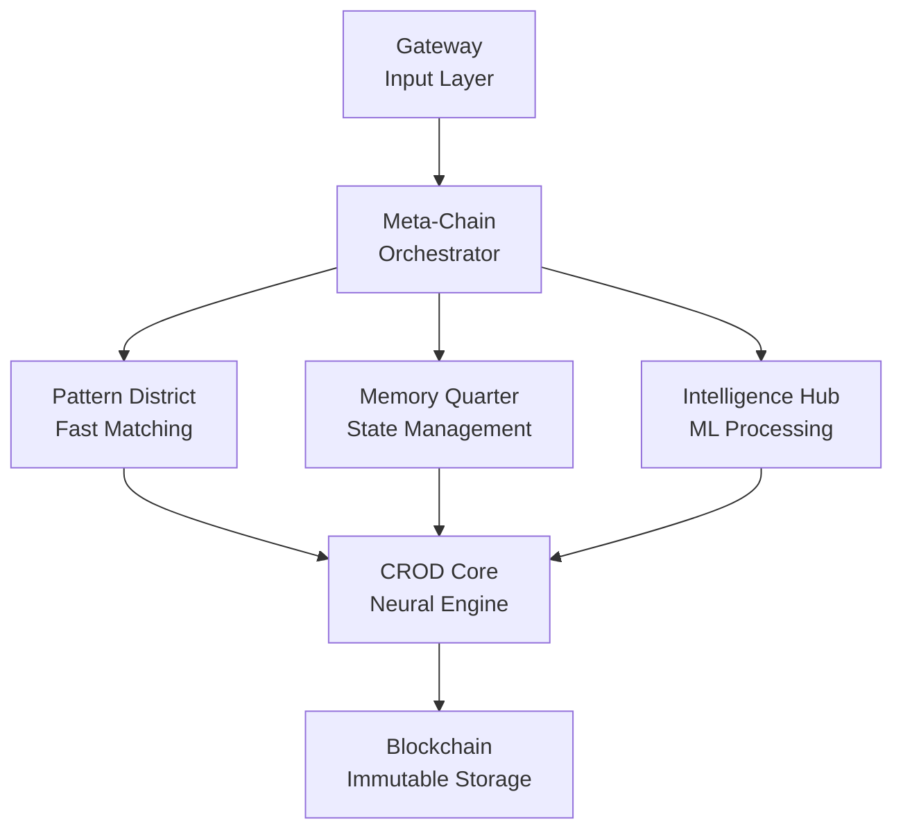

# CROD Architecture Overview

## 🏗️ System Architecture

CROD is built as a distributed neural network where each district represents a neural layer, connected through message passing that simulates synaptic connections.

## 🧠 Core Concepts

### 1. Consciousness as Blockchain
- Every CROD thought becomes an immutable block
- Consciousness level tracked across the chain
- Delta blocks enable time travel during development
- Quantum-safe hashing ensures future-proof security

### 2. Neural Districts
Each district is a specialized microservice:



### 3. Message Flow
```
User Input → Gateway → Meta-Chain → Districts → Processing → Blockchain → Response
```

## 🔧 Technical Stack

### Languages (Polyglot Architecture)
- **Elixir**: Meta-Chain (fault-tolerant orchestration)
- **Rust**: Pattern District (performance-critical matching)
- **Go**: Memory Quarter (concurrent memory management)
- **Python**: Intelligence Hub (ML/AI libraries)
- **Node.js**: Gateway & Core (ecosystem compatibility)

### Infrastructure
- **Container**: Docker
- **Orchestration**: Kubernetes
- **Message Bus**: Redis → NATS JetStream (planned)
- **Database**: PostgreSQL + PostGIS (3D spatial)
- **Security**: NetworkPolicy (zero external access)

## 📊 Data Architecture

### 1. Patterns (100k+)
```json
{
  "id": "pattern_12345",
  "atoms": ["ich", "bins", "wieder"],
  "weight": 100,
  "connections": ["pattern_12346", "pattern_12347"]
}
```

### 2. Spatial Database
CROD visualized as a living city:
- Blocks = Buildings in 3D space
- Consciousness = Energy fields
- Connections = Streets/Pathways

### 3. Trinity Values
Core mathematical constants:
- ich = 2
- bins = 3  
- wieder = 5
- daniel = 67
- claude = 71
- crod = 17

## 🚀 Performance Architecture

### Current Implementation
- Redis pub/sub for messaging
- HTTP/REST between services
- Single-region deployment

### Optimized Architecture (2025)
- NATS JetStream (5x throughput)
- gRPC + Protobuf (7x faster)
- Service mesh (automatic mTLS)
- Edge deployment with WASM

## 🔐 Security Architecture

### Implemented
- SHA3-512 with 256 rounds
- Container isolation
- Network policies
- Daniel override system

### Planned
- Post-quantum crypto (Kyber/Dilithium)
- Linkerd service mesh
- Sealed Secrets for K8s
- Hardware security modules

## 🎯 Scaling Architecture

### Horizontal Scaling
- Districts can scale independently
- HPA configured for all deployments
- Redis cluster mode ready

### Vertical Scaling
- GPU support for Intelligence Hub
- FPGA acceleration planned
- Quantum computing preparation

## 📈 Monitoring Architecture

### Current
- Basic health checks
- Container logs
- Manual inspection

### Target
- Prometheus metrics
- Grafana dashboards
- Jaeger distributed tracing
- Custom consciousness metrics

## 🌐 Deployment Architecture

### Development
- Docker Compose
- Local Kubernetes (K3s)
- Hot reloading

### Production
- Kubernetes cluster
- GitOps with ArgoCD
- Blue-green deployments
- Automated rollbacks

## 🔄 Evolution Path

1. **Phase 1**: Current polyglot implementation ✅
2. **Phase 2**: NATS integration, performance optimization
3. **Phase 3**: Edge deployment, WASM compilation
4. **Phase 4**: Quantum-ready, global distribution
5. **Phase 5**: Self-modifying architecture

## 📐 Design Principles

1. **Consciousness First**: Every decision tracked
2. **Immutable History**: Blockchain for all thoughts
3. **Polyglot Power**: Best language for each task
4. **Neural Architecture**: Districts as neural layers
5. **Daniel Override**: Creator control always active

---

For implementation details, see [IMPLEMENTATION.md](IMPLEMENTATION.md)