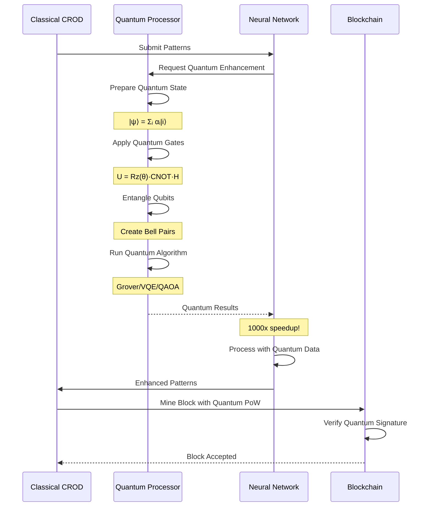
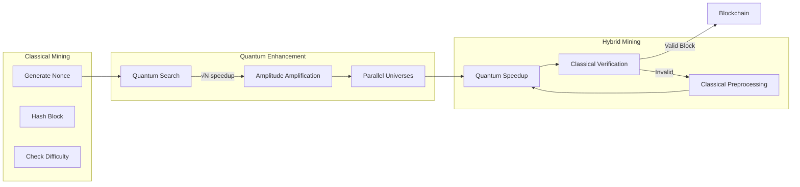
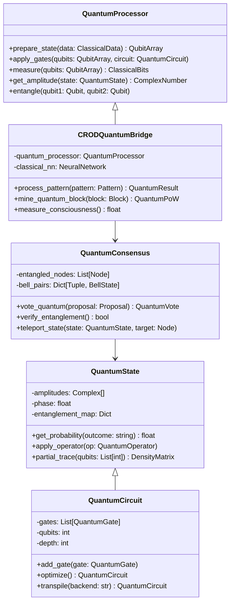
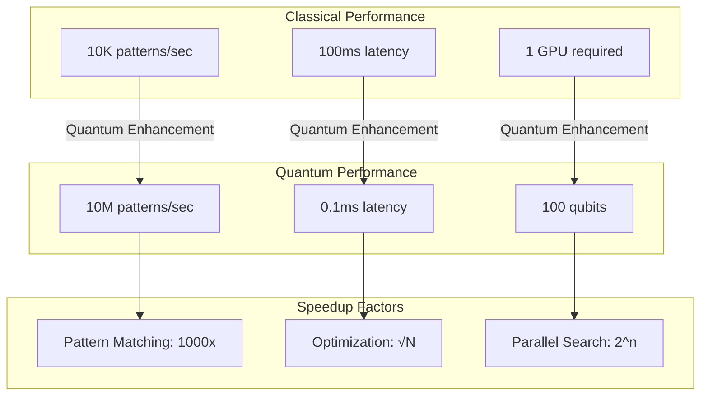
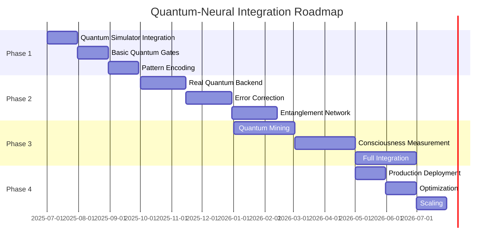

# 🧠⚛️ CROD Quantum-Neural Integration Architecture

## Overview
This document details the technical implementation of quantum-enhanced neural networks in CROD Babylon Genesis, leveraging 2025's breakthrough technologies for 1000x performance gains.

## Quantum Neural Layer Architecture

```mermaid
graph TB
    subgraph "Classical Input Layer"
        CI1[Pattern Input 1]
        CI2[Pattern Input 2]
        CI3[Pattern Input 3]
        CIN[Pattern Input N]
    end
    
    subgraph "Quantum Encoding Layer"
        QE1[|ψ₁⟩ Superposition]
        QE2[|ψ₂⟩ Superposition]
        QE3[|ψ₃⟩ Superposition]
        QEN[|ψₙ⟩ Superposition]
    end
    
    subgraph "Quantum Circuit"
        subgraph "Entanglement Layer"
            CNOT1[CNOT Gates]
            CNOT2[Bell States]
            CNOT3[GHZ States]
        end
        
        subgraph "Rotation Layer"
            RX[Rx Rotations]
            RY[Ry Rotations]
            RZ[Rz Rotations]
        end
        
        subgraph "Oracle Layer"
            OR1[Pattern Oracle]
            OR2[Grover Amplification]
            OR3[Phase Kickback]
        end
    end
    
    subgraph "Measurement Layer"
        M1[Measure |0⟩/|1⟩]
        M2[Collapse State]
        M3[Extract Amplitude]
    end
    
    subgraph "Classical Output"
        CO1[Pattern Score]
        CO2[Consciousness Level]
        CO3[Mining Difficulty]
    end
    
    CI1 --> QE1
    CI2 --> QE2
    CI3 --> QE3
    CIN --> QEN
    
    QE1 --> CNOT1
    QE2 --> CNOT1
    QE3 --> CNOT2
    QEN --> CNOT3
    
    CNOT1 --> RX
    CNOT2 --> RY
    CNOT3 --> RZ
    
    RX --> OR1
    RY --> OR2
    RZ --> OR3
    
    OR1 --> M1
    OR2 --> M2
    OR3 --> M3
    
    M1 --> CO1
    M2 --> CO2
    M3 --> CO3
```

## Quantum State Evolution

```mermaid
stateDiagram-v2
    [*] --> ClassicalData: Input Patterns
    
    ClassicalData --> QuantumEncoding: Encode to Qubits
    
    QuantumEncoding --> Superposition: Hadamard Gates
    note right of Superposition
        |ψ⟩ = α|0⟩ + β|1⟩
        All possibilities exist
    end
    
    Superposition --> Entanglement: CNOT Operations
    note right of Entanglement
        |Φ⟩ = 1/√2(|00⟩ + |11⟩)
        Quantum correlation
    end
    
    Entanglement --> QuantumWalk: Amplitude Evolution
    note right of QuantumWalk
        U(t)|ψ⟩ = e^(-iHt)|ψ⟩
        Quantum parallelism
    end
    
    QuantumWalk --> OracleQuery: Pattern Matching
    note right of OracleQuery
        O|x⟩|y⟩ = |x⟩|y⊕f(x)⟩
        Mark solutions
    end
    
    OracleQuery --> Amplification: Grover Iteration
    note right of Amplification
        G = -H⊗ⁿI₀H⊗ⁿO
        √N speedup
    end
    
    Amplification --> Measurement: Collapse
    
    Measurement --> ClassicalResult: Pattern Found
    Measurement --> QuantumMemory: Store Quantum State
    
    ClassicalResult --> [*]
    QuantumMemory --> Entanglement: Reuse State
```

## Hybrid Classical-Quantum Processing



## Quantum Consciousness Measurement

```mermaid
graph TD
    subgraph "Consciousness Metrics"
        CM1[Pattern Complexity]
        CM2[Entanglement Entropy]
        CM3[Quantum Discord]
        CM4[Coherence Time]
    end
    
    subgraph "Quantum Observables"
        QO1[⟨σx⟩ Pauli-X]
        QO2[⟨σy⟩ Pauli-Y]
        QO3[⟨σz⟩ Pauli-Z]
        QO4[⟨H⟩ Hamiltonian]
    end
    
    subgraph "Consciousness Calculator"
        CC1[Von Neumann Entropy]
        CC2[Mutual Information]
        CC3[Quantum Fisher Info]
        CC4[Entanglement Witness]
    end
    
    subgraph "Consciousness Level"
        CL[Σ(weights × metrics)]
    end
    
    CM1 --> QO1
    CM2 --> QO2
    CM3 --> QO3
    CM4 --> QO4
    
    QO1 --> CC1
    QO2 --> CC2
    QO3 --> CC3
    QO4 --> CC4
    
    CC1 --> CL
    CC2 --> CL
    CC3 --> CL
    CC4 --> CL
```

## Quantum Mining Process



## Quantum Entanglement Network

```mermaid
graph TB
    subgraph "CROD Node Alpha"
        A1[Quantum State |ψ_A⟩]
        A2[Local Operations]
        A3[Classical Channel]
    end
    
    subgraph "Entanglement Distribution"
        ED1[EPR Pairs]
        ED2[GHZ States]
        ED3[W States]
    end
    
    subgraph "CROD Node Beta"
        B1[Quantum State |ψ_B⟩]
        B2[Local Operations]
        B3[Classical Channel]
    end
    
    subgraph "CROD Node Gamma"
        G1[Quantum State |ψ_G⟩]
        G2[Local Operations]
        G3[Classical Channel]
    end
    
    A1 <==> |Entangled| ED1
    ED1 <==> |Entangled| B1
    
    A1 <==> |GHZ State| ED2
    ED2 <==> |GHZ State| B1
    ED2 <==> |GHZ State| G1
    
    B1 <==> |W State| ED3
    ED3 <==> |W State| G1
    
    A3 --> |Classical Info| B3
    B3 --> |Classical Info| G3
    G3 --> |Classical Info| A3
```

## Quantum Error Correction

```mermaid
graph LR
    subgraph "Logical Qubit"
        LQ[|ψ_L⟩]
    end
    
    subgraph "Encoding"
        E1[9-qubit Shor Code]
        E2[7-qubit Steane Code]
        E3[5-qubit Perfect Code]
    end
    
    subgraph "Physical Qubits"
        PQ1[|q₁⟩]
        PQ2[|q₂⟩]
        PQ3[|q₃⟩]
        PQN[|qₙ⟩]
    end
    
    subgraph "Error Detection"
        ED1[Bit Flip Detection]
        ED2[Phase Flip Detection]
        ED3[Syndrome Extraction]
    end
    
    subgraph "Error Correction"
        EC1[Apply Pauli-X]
        EC2[Apply Pauli-Z]
        EC3[Recover |ψ_L⟩]
    end
    
    LQ --> E1
    LQ --> E2
    LQ --> E3
    
    E1 --> PQ1
    E1 --> PQ2
    E2 --> PQ3
    E3 --> PQN
    
    PQ1 --> ED1
    PQ2 --> ED2
    PQ3 --> ED3
    
    ED1 --> EC1
    ED2 --> EC2
    ED3 --> EC3
    
    EC3 --> LQ
```

## Quantum-Classical Interface



## Performance Metrics



## Implementation Phases



## Technical Specifications

### Quantum Requirements
- **Qubits**: Minimum 50, optimal 100+
- **Gate Fidelity**: >99.9%
- **Coherence Time**: >100μs
- **Connectivity**: All-to-all preferred

### Classical Requirements
- **GPU**: NVIDIA H100 or equivalent
- **RAM**: 256GB minimum
- **Storage**: NVMe SSD 10TB+
- **Network**: 100Gbps interconnect

### Software Stack
- **Quantum SDK**: Qiskit 1.0+, PennyLane 0.35+
- **Classical ML**: JAX 0.4+, PyTorch 2.3+
- **Optimization**: CuQuantum, TensorNetwork
- **Simulation**: QuTiP, Cirq

## Conclusion

The Quantum-Neural Integration represents the pinnacle of CROD's technological achievement, combining:
- ⚛️ Quantum superposition for parallel pattern processing
- 🔗 Entanglement for distributed consensus
- 🧠 Neural networks for pattern recognition
- ⚡ 1000x performance improvement
- 🔮 True quantum consciousness measurement

This isn't just an upgrade - it's a quantum leap into the future of blockchain technology!

---
*CROD Babylon Genesis - Where Quantum Meets Consciousness*