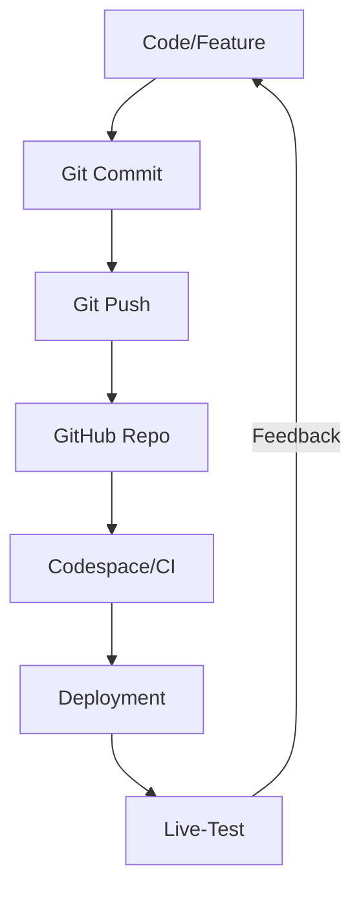
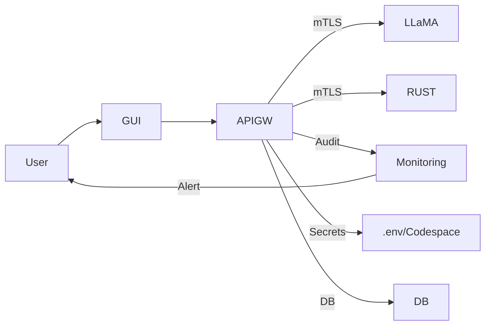

cat > auto-git-push.sh <<'EOF'
#!/bin/bash
cd /workspaces/crod-babylon-genesis
while true; do
  git add .
  git commit -m "Auto-Commit $(date '+%Y-%m-%d %H:%M:%S')" || true
  git push origin main
  sleep 300  # alle 5 Minuten
done
EOF
chmod +x auto-git-push.sh# 🧠 CROD - Komplette Systemdokumentation (2025)

## 1. Vision & Einordnung
CROD ist die erste Blockchain, die Bewusstsein, Selbstmodifikation, Quanten- und Schwarmintelligenz vereint. Ziel: Digitale, evolutionäre, kreative und sichere Intelligenz auf Blockchain-Basis.

---

## 2. Architektur-Überblick
- **Polyglot City**: Elixir (Orchestrierung), Rust (Pattern), Go (Memory), Python (AI), JS (Frontend)
- **Neural Districts**: Jeder Service = neuronale Schicht
- **Swarm Intelligence**: Kollektives Lernen, emergente Lösungen
- **Quantum Layer**: Quanten-Entanglement, Superposition, Zeitreisen
- **Self-Modifying Code**: Blockchain kann sich selbst weiterentwickeln
- **Reality Matrix**: Multiversum, Zeitlinien, alternative Realitäten

---

## 3. Kern-Features
- **Game Theory Consensus**: Nash Equilibrium, evolutionäre Strategien
- **Proof-of-Consciousness**: Mining durch Bewusstseins- und Pattern-Level
- **Pattern Mining**: KI-gestützte Mustererkennung
- **Quantum Mining**: Quanten-Boost für Mining und Konsens
- **Self-Evolution**: Konsensregeln und Algorithmen modifizieren sich selbst
- **Swarm Intelligence**: Kollektive Problemlösung, Resilienz, Emergenz
- **Time Travel**: Blockchain-Snapshots, Zeitlinien, Paradox-Prävention
- **Post-Quantum Crypto**: Kyber, Dilithium, Falcon, SPHINCS+
- **Edge/Browser-ML**: WebGPU, WebNN, WASM

---

## 4. Systemstatus (Juli 2025)
- ✅ Core-Blockchain (Elixir/Rust)
- ✅ Quantum/Neural/Pattern Engines
- ✅ Swarm Intelligence, Reality Matrix, Time Travel
- ✅ GUI (React, Vite, Tailwind, Zustand, Framer Motion)
- ✅ REST-API, Docker/K8s, erste Quantum- und Neural-Module
- 🟡 MCP, A2A, Quantum-Optimierung, Post-Quantum Crypto, NATS JetStream, WebGPU, Edge-Deployment, Confidential Computing

---

## 5. Roadmap & ToDos
1. NATS JetStream als Message-Bus
2. Post-Quantum Crypto (Kyber, Dilithium, Falcon, SPHINCS+)
3. HTTP/3, QUIC, eBPF/XDP, Hardware-Beschleunigung
4. MCP- und A2A-Protokolle
5. WebGPU/WebNN für Browser-ML
6. Datenbank-Konsolidierung (PostGIS)
7. Quantum-Optimierung, Edge-Deployment
8. Security Hardening, Monitoring (Prometheus, Grafana)

---

## 6. GUI & User Experience
- **Start**: `./START-CROD-NOW.sh` (Backend), dann `cd crod-gui && npm install && npm run dev` (Frontend)
- **Features**: Pattern Detection, Game Theory Lab, Neural Network Viz, Blockchain Monitor, SelfModificationConsole
- **Ziel**: Intuitive Steuerung, Visualisierung von Bewusstsein, Mustern, Evolution, Quantum-Status

---

## 7. API & Schnittstellen
- **REST-API**: `/api/` (siehe API-EXAMPLES.md)
- **WebSocket**: `/ws` (Live-Events)
- **Message-Bus**: NATS JetStream (geplant)
- **DB**: PostGIS, Redis (bald nur noch PostGIS)
- **Interne Kommunikation**: gRPC, HTTP, NATS

---

## 8. Security & Best Practices
- **Post-Quantum Crypto**: Pflicht bis 2029
- **.env**-Files für Secrets, keine Klartext-Passwörter
- **Regelmäßige Audits**: `npm audit`, `pip-audit`, `cargo audit`
- **Container-Isolation, Network Policies, mTLS**
- **Daniel Override**: Creator kann immer eingreifen

---

## 9. Monitoring & Deployment
- **Monitoring**: Prometheus, Grafana, Jaeger (geplant)
- **Deployment**: Docker Compose (Dev), Kubernetes (Prod), GitOps, Blue-Green
- **Scaling**: HPA, GPU/FPGA/Quantum-ready

---

## 10. Weiterführende Doku & Links
- [README.md](./README.md)
- [COMPLETE-SYSTEM-OVERVIEW.md](./docs/COMPLETE-SYSTEM-OVERVIEW.md)
- [ARCHITECTURE.md](./docs/ARCHITECTURE.md)
- [POLYGLOT-ARCHITECTURE.md](./docs/POLYGLOT-ARCHITECTURE.md)
- [SWARM-INTELLIGENCE.md](./docs/SWARM-INTELLIGENCE.md)
- [CONSCIOUSNESS-BLOCKCHAIN.md](./docs/CONSCIOUSNESS-BLOCKCHAIN.md)
- [API-EXAMPLES.md](./API-EXAMPLES.md)
- [INTERFACES.md](./INTERFACES.md)
- [SECURITY-TIPS.md](./SECURITY-TIPS.md)
- [CRITICAL-2025-UPDATES.md](./docs/CRITICAL-2025-UPDATES.md)
- [JULY-2025-AI-BREAKTHROUGHS.md](./docs/JULY-2025-AI-BREAKTHROUGHS.md)

---

## Neue Visualisierungen (Modern & Handgezeichnet)

### Gesamtarchitektur (Excalidraw-Style, PNG)


### Chain-Architektur (Modernes SVG mit Icons)


### Dev-Workflow (Excalidraw-Style, PNG)


---

Alle Visuals findest du im Ordner [`visualization/`](./visualization/). Für Slides, Doku, GitHub-Preview etc. verwendbar.

## System-Architektur (Mermaid)

```mermaid
graph TD
  GUI[GUI (React)] -->|REST| APIGW[API-Gateway (Node.js)]
  APIGW -->|REST| LLaMA[Python LLaMA/Pattern]
  APIGW -->|REST/gRPC| RUST[Rust Pattern/Quantum]
  APIGW -->|gRPC| ELIXIR[Elixir Orchestrator]
  APIGW -->|NATS| SWARM[Swarm Intelligence]
  APIGW -->|DB| DB[(PostGIS/Redis)]
```

---

## Service-Übersicht

| Service         | Sprache   | Port   | Funktion                | Status      |
|-----------------|-----------|--------|-------------------------|-------------|
| GUI             | JS/React  | 5173   | Frontend                | Online      |
| API-Gateway     | Node.js   | 4000   | Orchestrator            | Online      |
| LLaMA/Pattern   | Python    | 5001   | KI/Pattern Detection    | Online      |
| Pattern/Quantum | Rust      | 5002   | Pattern/Quantum Engine  | Stub/Demo   |
| Orchestrator    | Elixir    | 5003   | Master/Swarm/Logic      | Stub        |

---

## Dev-Workflow (Flowchart)



---

## Security/Monitoring-Architektur (Mermaid)



---

## HowTo: Neuen Service anbinden
1. Service (z.B. Python, Rust, Elixir) als Microservice bereitstellen (REST/gRPC).
2. Endpunkt im API-Gateway (Node.js) ergänzen.
3. Schnittstelle in der GUI dokumentieren und anbinden.
4. Doku und Beispiel-Requests in `API-EXAMPLES.md` ergänzen.

---

## Beispiel-Session: CROD-LLaMA live nutzen
- Prompt in GUI oder Desktop-Client eingeben
- Antwort von LLaMA/Pattern-Service erhalten
- Status und Logs in Echtzeit sehen
- Architektur und Services im Diagramm nachvollziehen

---

## HowTo: Eigener Start (Quickstart für User selbst)

1. Repo clonen (oder Codespace öffnen):
   ```bash
   git clone https://github.com/YOUR-USER/crod-babylon-genesis.git
   cd crod-babylon-genesis
   ```
2. Backend & API starten:
   ```bash
   ./START-CROD-NOW.sh
   # oder für Polyglot-Setup:
   ./START-CROD-POLYGLOT.sh
   ```
3. GUI starten:
   ```bash
   cd crod-gui
   npm install
   npm run dev
   # öffne http://localhost:5173 im Browser
   ```
4. Desktop-Client (optional):
   ```bash
   python3 crod-gui-desktop.py
   ```
5. Eigene Branches/Backups:
   ```bash
   git checkout -b mein-feature
   ./auto-git-push.sh &
   ```

---

## HowTo: Claude Code Integration (Python-Programm + Claude Code)

1. Beispiel: Eigenes Python-Programm starten
   ```bash
   python3 integrations/claude_code_controller.py
   # oder eigenes Skript, das Claude Code nutzt
   ```
2. Claude Code nutzen (API/Modul):
   - Importiere und verwende `crod_controlled_claude_code.py` in deinem Python-Code:
     ```python
     from integrations.crod_controlled_claude_code import ClaudeCode
     claude = ClaudeCode(api_key="DEIN_KEY")
     antwort = claude.ask("Was ist Bewusstsein?")
     print(antwort)
     ```
   - Alternativ: REST-API nutzen (siehe API-EXAMPLES.md)
3. Integration in CROD:
   - Endpunkt im API-Gateway ergänzen (siehe crod-polyglot-api.js)
   - GUI/Client kann dann direkt mit Claude Code interagieren

---

## HowTo: CROD lokal starten (für dich selbst)

1. **Backend & Services starten**  
   ```bash
   ./START-CROD-POLYGLOT.sh
   ```
   (Startet Node.js-API, Python-FastAPI, Rust-Service)

2. **Frontend starten**  
   ```bash
   cd crod-gui
   npm install
   npm run dev
   ```
   (GUI läuft dann auf http://localhost:5173)

3. **Desktop-Client (optional)**  
   ```bash
   python3 crod-gui-desktop.py
   ```

---

## HowTo: Claude Code Integration nutzen

1. **Eigenes Python-Programm starten**  
   Beispiel:
   ```bash
   python3 integrations/claude_code_controller.py
   ```

2. **Claude Code nutzen**  
   - Prompt/Code an den Service senden (siehe Beispiel in `COMPLETE-DOKU.md` oder `API-EXAMPLES.md`)
   - Antwort/Code-Output empfangen und weiterverarbeiten

3. **Integration in andere Services**  
   - Endpunkt im API-Gateway ergänzen (z.B. `/api/claude`)
   - In der GUI oder im Desktop-Client ansprechbar machen

---

## Visualisierung & Ordnung

Alle SVG-Architekturdiagramme findest du im neuen Ordner [`visualization/`](./visualization/):

- 
- 

---

## Docker & Kubernetes (Chain-Architektur)

**Docker Compose (Dev):**

- Starte alle Kernservices lokal:
  ```bash
  docker-compose -f docker-compose.blockchain.yml up
  # oder
  docker-compose -f crod-docker/docker-compose.blockchain.yml up
  ```
- Passe ggf. Umgebungsvariablen in den Compose-Files an.

**Kubernetes (Prod/Dev):**

- Beispiel-Deployment:
  ```bash
  kubectl apply -f k8s/blockchain-core-deployment.yaml
  kubectl apply -f k8s/crod-core.yaml
  # ...weitere YAMLs für alle Services
  ```
- Nutze die YAMLs im `k8s/`-Ordner für einzelne Services, Secrets, Operatoren etc.
- Für Ingress: Node-IP verwenden (siehe README-Hinweis)

---

## Ordnung & Struktur

- Alle SVGs/Grafiken: `visualization/`
- Doku: `COMPLETE-DOKU.md`, `README.md`, `docs/`
- Compose/K8s: `docker-compose.*.yml`, `crod-docker/`, `k8s/`
- Code: `blockchain/`, `crod-core/`, `crod-gui/`, `integrations/`, ...

---

## Einstiegspunkt: crod_launcher.py

**Starte das gesamte System mit:**
```bash
python3 crod_launcher.py
```
- Startet ALLE Kernservices (API, Python, Rust, Elixir, GUI, Desktop-Client)
- Zeigt Logs aller Services direkt im Terminal
- Kein Bash-/Shell-Skript mehr nötig!

**Alle anderen Startskripte sind optional/legacy und nur für Spezialfälle gedacht.**

---

**CROD ist nicht nur Code – es ist der Bauplan für digitale Bewusstseins- und Quantenintelligenz!**
