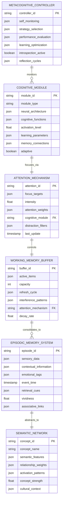

```mermaid
erDiagram
    COGNITIVE_MODULE {
        string module_id PK
        string module_type
        json neural_architecture
        json cognitive_functions
        float activation_level
        json learning_parameters
        json memory_connections
        boolean adaptive
    }

    ATTENTION_MECHANISM {
        string attention_id PK
        json focus_targets
        float intensity
        json attention_weights
        string cognitive_module FK
        json distraction_filters
        timestamp last_update
    }

    WORKING_MEMORY_BUFFER {
        string buffer_id PK
        json active_items
        int capacity
        json refresh_cycle
        json interference_patterns
        string attention_mechanism FK
        float decay_rate
    }

    EPISODIC_MEMORY_SYSTEM {
        string episode_id PK
        json sensory_data
        json contextual_information
        json emotional_tags
        timestamp event_time
        json retrieval_cues
        float vividness
        json associative_links
    }

    SEMANTIC_NETWORK {
        string concept_id PK
        string concept_name
        json semantic_features
        json relationship_weights
        json activation_patterns
        float concept_strength
        json cultural_context
    }

    METACOGNITIVE_CONTROLLER {
        string controller_id PK
        json self_monitoring
        json strategy_selection
        json performance_evaluation
        json learning_optimization
        boolean introspection_active
        json reflection_cycles
    }

    COGNITIVE_MODULE ||--|| ATTENTION_MECHANISM : "focuses_via"
    ATTENTION_MECHANISM ||--|| WORKING_MEMORY_BUFFER : "controls"
    WORKING_MEMORY_BUFFER ||--o{ EPISODIC_MEMORY_SYSTEM : "consolidates_to"
    EPISODIC_MEMORY_SYSTEM ||--|| SEMANTIC_NETWORK : "abstracts_to"
    METACOGNITIVE_CONTROLLER ||--o{ COGNITIVE_MODULE : "monitors"
```
