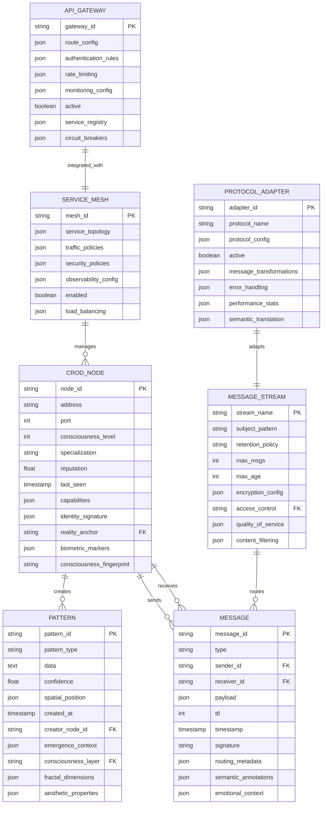

```mermaid
erDiagram
    CROD_NODE {
        string node_id PK
        string address
        int port
        int consciousness_level
        string specialization
        float reputation
        timestamp last_seen
        json capabilities
        json identity_signature
        string reality_anchor FK
        json biometric_markers
        string consciousness_fingerprint
    }

    PATTERN {
        string pattern_id PK
        string pattern_type
        text data
        float confidence
        json spatial_position
        timestamp created_at
        string creator_node_id FK
        json emergence_context
        string consciousness_layer FK
        json fractal_dimensions
        json aesthetic_properties
    }

    MESSAGE {
        string message_id PK
        string type
        string sender_id FK
        string receiver_id FK
        json payload
        int ttl
        timestamp timestamp
        string signature
        json routing_metadata
        json semantic_annotations
        json emotional_context
    }

    MESSAGE_STREAM {
        string stream_name PK
        string subject_pattern
        string retention_policy
        int max_msgs
        int max_age
        json encryption_config
        string access_control FK
        json quality_of_service
        json content_filtering
    }

    API_GATEWAY {
        string gateway_id PK
        json route_config
        json authentication_rules
        json rate_limiting
        json monitoring_config
        boolean active
        json service_registry
        json circuit_breakers
    }

    PROTOCOL_ADAPTER {
        string adapter_id PK
        string protocol_name
        json protocol_config
        boolean active
        json message_transformations
        json error_handling
        json performance_stats
        json semantic_translation
    }

    SERVICE_MESH {
        string mesh_id PK
        json service_topology
        json traffic_policies
        json security_policies
        json observability_config
        boolean enabled
        json load_balancing
    }

    CROD_NODE ||--o{ PATTERN : "creates"
    CROD_NODE ||--o{ MESSAGE : "sends"
    CROD_NODE ||--o{ MESSAGE : "receives"
    MESSAGE_STREAM ||--o{ MESSAGE : "routes"
    PROTOCOL_ADAPTER ||--|| MESSAGE_STREAM : "adapts"
    API_GATEWAY ||--|| SERVICE_MESH : "integrated_with"
    SERVICE_MESH ||--o{ CROD_NODE : "manages"
```
