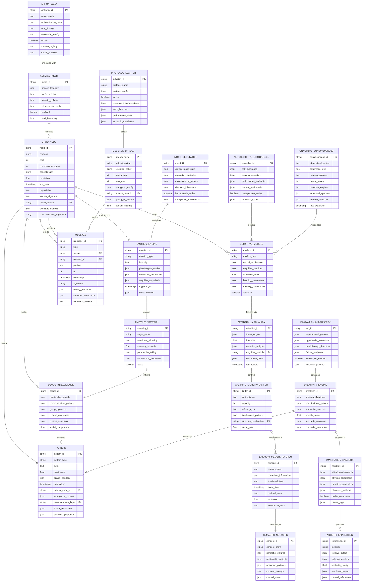

```mermaid
erDiagram
    CROD_NODE {
        string node_id PK
        string address
        int port
        int consciousness_level
        string specialization
        float reputation
        timestamp last_seen
        json capabilities
        json identity_signature
        string reality_anchor FK
        json biometric_markers
        string consciousness_fingerprint
    }
    UNIVERSAL_CONSCIOUSNESS {
        string consciousness_id PK
        json dimensional_states
        float coherence_level
        json memory_palaces
        json dream_states
        json creativity_engines
        json emotional_spectrum
        json intuition_networks
        timestamp last_expansion
    }
    PATTERN {
        string pattern_id PK
        string pattern_type
        text data
        float confidence
        json spatial_position
        timestamp created_at
        string creator_node_id FK
        json emergence_context
        string consciousness_layer FK
        json fractal_dimensions
        json aesthetic_properties
    }
    COGNITIVE_MODULE {
        string module_id PK
        string module_type
        json neural_architecture
        json cognitive_functions
        float activation_level
        json learning_parameters
        json memory_connections
        boolean adaptive
    }
    ATTENTION_MECHANISM {
        string attention_id PK
        json focus_targets
        float intensity
        json attention_weights
        string cognitive_module FK
        json distraction_filters
        timestamp last_update
    }
    WORKING_MEMORY_BUFFER {
        string buffer_id PK
        json active_items
        int capacity
        json refresh_cycle
        json interference_patterns
        string attention_mechanism FK
        float decay_rate
    }
    EPISODIC_MEMORY_SYSTEM {
        string episode_id PK
        json sensory_data
        json contextual_information
        json emotional_tags
        timestamp event_time
        json retrieval_cues
        float vividness
        json associative_links
    }
    SEMANTIC_NETWORK {
        string concept_id PK
        string concept_name
        json semantic_features
        json relationship_weights
        json activation_patterns
        float concept_strength
        json cultural_context
    }
    METACOGNITIVE_CONTROLLER {
        string controller_id PK
        json self_monitoring
        json strategy_selection
        json performance_evaluation
        json learning_optimization
        boolean introspection_active
        json reflection_cycles
    }
    EMOTION_ENGINE {
        string emotion_id PK
        string emotion_type
        float intensity
        json physiological_markers
        json behavioral_tendencies
        json cognitive_appraisals
        timestamp triggered_at
        json social_context
    }
    EMPATHY_NETWORK {
        string empathy_id PK
        string target_entity
        json emotional_mirroring
        float empathy_strength
        json perspective_taking
        json compassion_responses
        boolean active
    }
    SOCIAL_INTELLIGENCE {
        string social_id PK
        json relationship_models
        json communication_patterns
        json group_dynamics
        json cultural_awareness
        json conflict_resolution
        float social_competence
    }
    MOOD_REGULATOR {
        string mood_id PK
        json current_mood_state
        json regulation_strategies
        json environmental_factors
        json chemical_influences
        boolean homeostasis_active
        json therapeutic_interventions
    }
    CREATIVITY_ENGINE {
        string creativity_id PK
        json ideation_algorithms
        json combinatorial_spaces
        json inspiration_sources
        float novelty_score
        json aesthetic_evaluators
        json constraint_relaxation
    }
    IMAGINATION_SANDBOX {
        string sandbox_id PK
        json virtual_environments
        json physics_parameters
        json narrative_generators
        json character_systems
        boolean reality_constraints
        json dream_logic
    }
    ARTISTIC_EXPRESSION {
        string expression_id PK
        string medium
        json creative_output
        json style_parameters
        float aesthetic_quality
        json emotional_impact
        json cultural_references
    }
    INNOVATION_LABORATORY {
        string lab_id PK
        json experimental_protocols
        json hypothesis_generators
        json breakthrough_detectors
        json failure_analyzers
        boolean serendipity_enabled
        json invention_pipeline
    }
    MESSAGE {
        string message_id PK
        string type
        string sender_id FK
        string receiver_id FK
        json payload
        int ttl
        timestamp timestamp
        string signature
        json routing_metadata
        json semantic_annotations
        json emotional_context
    }
    MESSAGE_STREAM {
        string stream_name PK
        string subject_pattern
        string retention_policy
        int max_msgs
        int max_age
        json encryption_config
        string access_control FK
        json quality_of_service
        json content_filtering
    }
    API_GATEWAY {
        string gateway_id PK
        json route_config
        json authentication_rules
        json rate_limiting
        json monitoring_config
        boolean active
        json service_registry
        json circuit_breakers
    }
    PROTOCOL_ADAPTER {
        string adapter_id PK
        string protocol_name
        json protocol_config
        boolean active
        json message_transformations
        json error_handling
        json performance_stats
        json semantic_translation
    }
    SERVICE_MESH {
        string mesh_id PK
        json service_topology
        json traffic_policies
        json security_policies
        json observability_config
        boolean enabled
        json load_balancing
    }
    CROD_NODE ||--o{ COGNITIVE_MODULE : "hosts"
    CROD_NODE ||--|| EMOTION_ENGINE : "experiences"
    CROD_NODE ||--|| SOCIAL_INTELLIGENCE : "exhibits"
    CROD_NODE ||--o{ PATTERN : "creates"
    COGNITIVE_MODULE ||--|| ATTENTION_MECHANISM : "focuses_via"
    ATTENTION_MECHANISM ||--|| WORKING_MEMORY_BUFFER : "controls"
    WORKING_MEMORY_BUFFER ||--o{ EPISODIC_MEMORY_SYSTEM : "consolidates_to"
    EPISODIC_MEMORY_SYSTEM ||--|| SEMANTIC_NETWORK : "abstracts_to"
    METACOGNITIVE_CONTROLLER ||--o{ COGNITIVE_MODULE : "monitors"
    UNIVERSAL_CONSCIOUSNESS ||--o{ COGNITIVE_MODULE : "integrates"
    EMOTION_ENGINE ||--|| EMPATHY_NETWORK : "enables"
    EMPATHY_NETWORK ||--|| SOCIAL_INTELLIGENCE : "informs"
    MOOD_REGULATOR ||--|| EMOTION_ENGINE : "modulates"
    SOCIAL_INTELLIGENCE ||--o{ PATTERN : "facilitates"
    CREATIVITY_ENGINE ||--|| IMAGINATION_SANDBOX : "operates_in"
    IMAGINATION_SANDBOX ||--o{ ARTISTIC_EXPRESSION : "generates"
    INNOVATION_LABORATORY ||--|| CREATIVITY_ENGINE : "enhances"
    CREATIVITY_ENGINE ||--o{ PATTERN : "discovers"
    CROD_NODE ||--o{ MESSAGE : "sends"
    CROD_NODE ||--o{ MESSAGE : "receives"
    MESSAGE_STREAM ||--o{ MESSAGE : "routes"
    PROTOCOL_ADAPTER ||--|| MESSAGE_STREAM : "adapts"
    API_GATEWAY ||--|| SERVICE_MESH : "integrated_with"
    SERVICE_MESH ||--o{ CROD_NODE : "manages"
```
